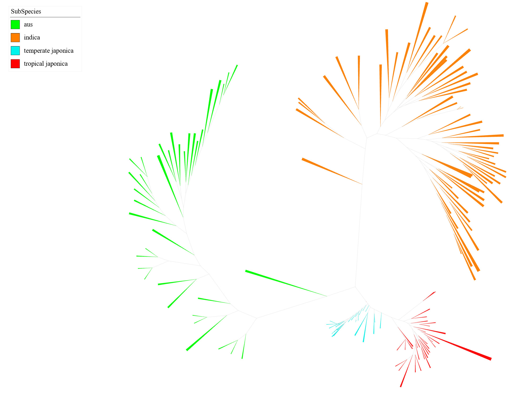
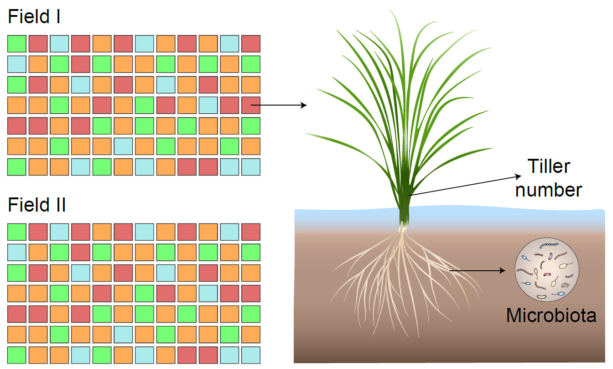
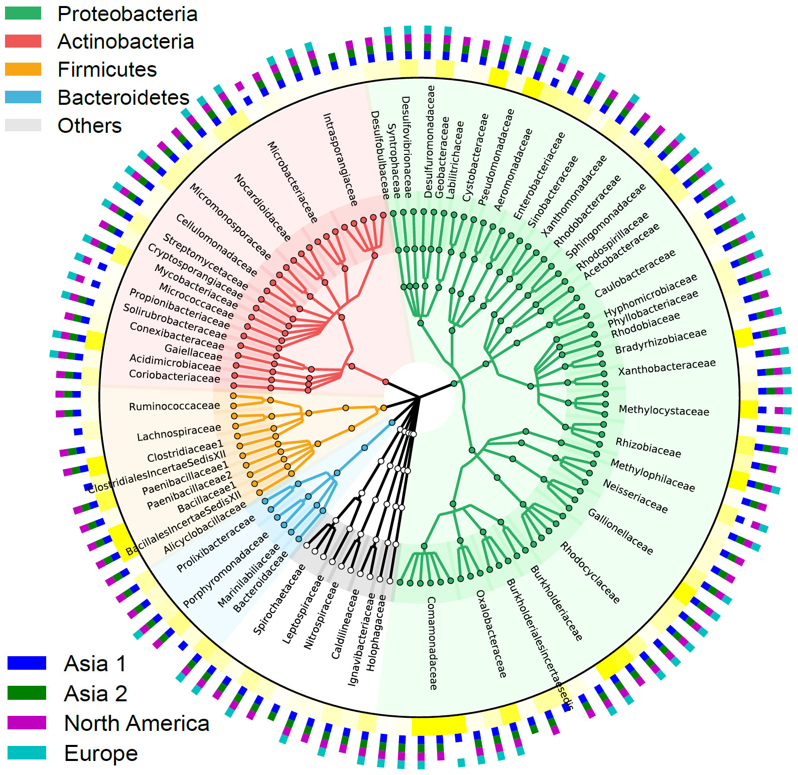
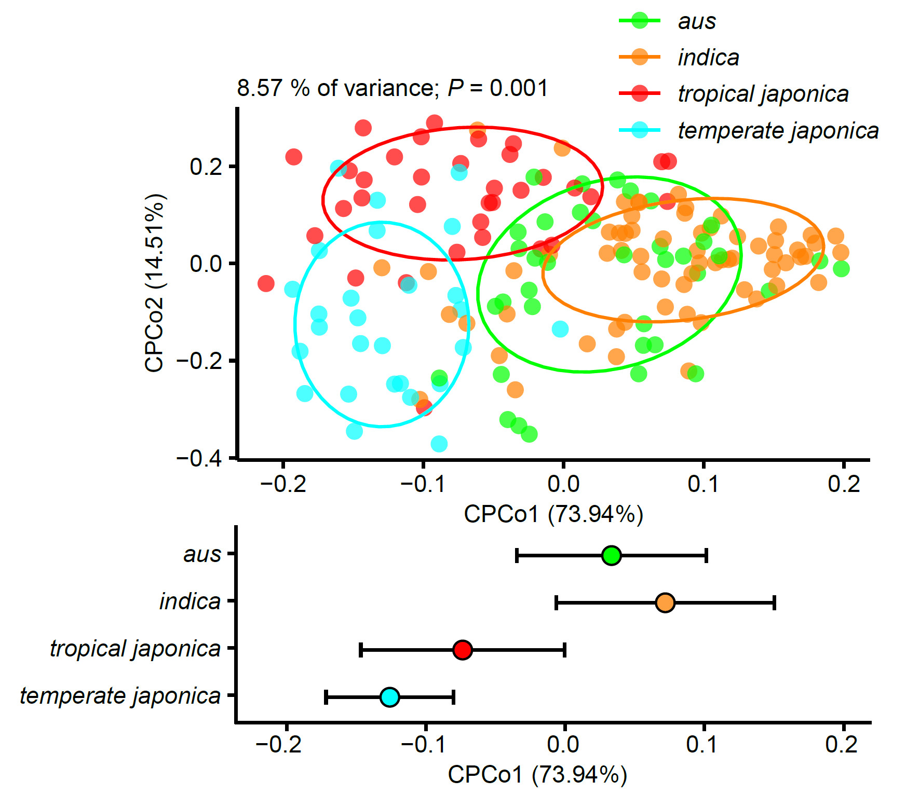
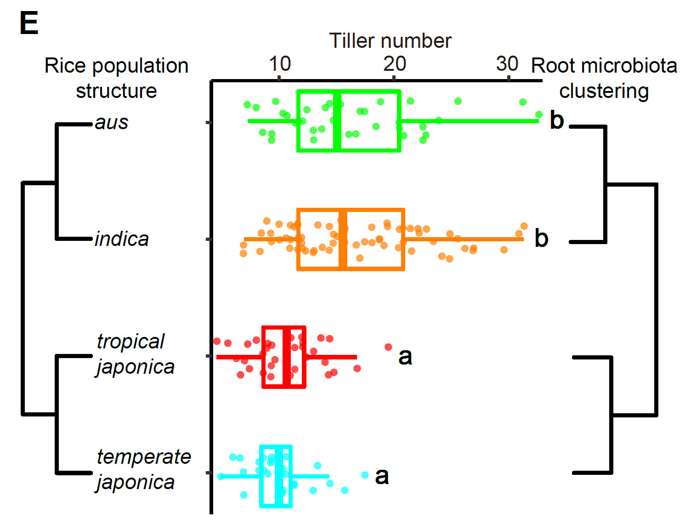
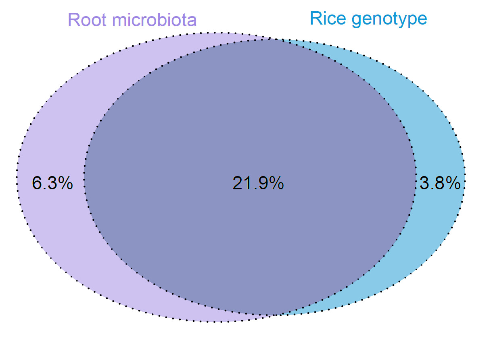

```{r setup, include=FALSE}
knitr::opts_chunk$set(echo = TRUE)

knitr::opts_chunk$set(
	echo=T, comment=NA, message=F, warning=F,
	fig.align="center", fig.width=6, fig.height=4, dpi=300)

# Clean workspace
rm(list=ls())
# Load home-made functions and parameters
source("http://210.75.224.110/stat_plot_functions.R")
# Set output figure size
w=89
h=59
```

Note: Non-letters are sometimes illegal variable names. In the analysis, the subspecies name aus, indica, tropical japonica and temperate japonica is abbreviated as AUS, IND, TRJ and TEJ.

# Figure 1. Root microbiota and its interaction with rice genotype contribute to tiller number variation in a field-grown rice population

## 1A. Unrooted phylogenetic tree

Note: the following script need running in Bash command line.

```
# Construct phylogenetic tree by by IQ-TREE v1.6.12
gunzip merge_seq.fa.gz # decompress
iqtree -s merge_seq.fa -st DNA -m TEST -bb 1000 -alrt 1000 -nt 20 -pre iqtree165 -quiet
# Generate annotation file
# Note: table2itol.R from https://github.com/mgoeker/table2itol
Rscript ../script/table2itol.R -a -d -c none -D planB -b Subspecies -i OTUID -l OTUID -t %s -w 0.5 ../data/cultivar.txt
```

Then the tree file is visulized in iTOL (https://itol.embl.de/). 
Add tree color file (iTOL_treecolors-Subspecies.txt) as annotation.
Save file as 1a.Tree165SubSpecies.svg


(A) Unrooted phylogenetic tree of the 165 landrace rice varieties examined in this study based on 58,450 missense SNPs. Branch length is shown according to the scale. Branches are colored according to subspecies: aus (green), indica (orange), tropical japonica (red), and temperate japonica (blue).

## 1B. The experimental design used for the field trials

This figure is hand-drawn by using Adobe Illustrator.



(B) The experimental design used for the field trials. The aus, indica, tropical japonica, and temperate japonica rice varieties were arranged randomly in two test fields. Root microbiota samples were harvested, and tiller number was counted for each variety. 

## 1C. 115 genera of core OTUs

The plotting script following our previous study in Nature Biotechnology(doi: 10.1038/s41587-019-0104-4). Detail in https://github.com/YongxinLiu/Note/tree/master/R/format2graphlan

The data download from previous published papers, detail in References.



(C) The bacterial genera of the 284 root OTUs were reproducibly detected in rice root microbiota studies in North America, Europe, and Asia. The inner ring represents 115 genera of 284 OTUs labeled at the family level. The outer rings represent the relative abundance of each genus in this study (yellow) and previously published work in the field in North America (purple, 107 out of 115; Edwards et al., 2019), Europe (cyan, 74 out of 115; Bertani et al., 2016), Asia 1 (blue, 115 out of 115; Zhang et al., 2019), and Asia 2 (green, 104 out of 115; Mori et al., 2016). 

## 1D. Constrained PCoA with Bray–Curtis distance

### Upper: Constrained PCoA with Bray–Curtis distance of the root microbiota by subspecies in field I

```{r}
metadata = read.table("../data/cultivar_LN_metadata.txt", header=T, row.names=1, sep="\t", comment.char="", stringsAsFactors=F)
# Set subspecies level
level=c("AUS","IND","TRJ","TEJ" )
metadata$group = factor(metadata$Subspecies, level)
levels(metadata$group) = c("aus","indica","tropical japonica","temperate japonica")

sub_design = metadata
m = "bray"
beta = read.table(paste("../data/cultivar_LN_otutab_norm.txt",sep=""), header=T, row.names=1, sep="\t", comment.char="") 

# Extract only those samples in common between the two tables
idx = rownames(sub_design) %in% colnames(beta)
sub_design=sub_design[idx,]
sub_beta=beta[,rownames(sub_design)]

# normalize to 100
otutab = t(sub_beta)/colSums(sub_beta,na=T)*100

# Constrained analysis OTU table by genotype
capscale.gen = capscale(otutab ~ group, data=sub_design, add=F, sqrt.dist=T, distance= m) 

# ANOVA-like permutation analysis
perm_anova.gen = anova.cca(capscale.gen, permutations = 1000, parallel = 9)

# generate variability tables and calculate confidence intervals for the variance
var_tbl.gen = variability_table(capscale.gen)
eig = capscale.gen$CCA$eig
variance = var_tbl.gen["constrained", "proportion"]
p.val = perm_anova.gen[1, 4]

# extract the weighted average (sample) scores
points = capscale.gen$CCA$wa
# save coordinate site
write.table("Axis\t", file=paste("1d.cpcoa.txt",sep = ""), append = F, sep="\t", quote=F,  eol = "",row.names=F, col.names=F)
suppressWarnings(write.table(points, file=paste("1d.cpcoa.txt",sep = ""), append = T, sep="\t", quote=F, row.names=T, col.names=T))

points = capscale.gen$CCA$wa[, 1:2]
points = as.data.frame(points)
points = cbind(points, sub_design$group)
colnames(points) = c("PC1", "PC2", "group")
# The picture is reversed horizontally (optional)
points$PC2 = points$PC2 * -1 

# plot PC 1 and 2
p = ggplot(points, aes(x=PC1, y=PC2, color=group)) + geom_point(alpha=.7, size=2) +
	labs(x=paste("CPCo1 (", format(100 * eig[1] / sum(eig), digits=4), "%)", sep=""),
	y=paste("CPCo2 (", format(100 * eig[2] / sum(eig), digits=4), "%)", sep="")) + 
	ggtitle(paste(format(100 * variance, digits=3), " % of variance; p=",format(p.val, digits=2),sep="")) + 
	theme_classic() + main_theme
p = p + stat_ellipse(level=0.68)
color = c("#00FF00","#FF8000", "#FF0000", "#00FFFF" )
p = p + scale_color_manual(values = color)
p
ggsave(paste("1d.LN_beta_cpcoa.pdf", sep=""), p, width = w*1.25, height = h*1.15, units = "mm")
```

### Bottom: error bar plot for CPCo1

```{r}
# reorder subspecies
points$group = factor(points$group, levels = c("temperate japonica","tropical japonica","indica","aus"))

## plot error bar plot
index = points[,c(1,3)]
index2 <- summarySE(index, measurevar = "PC1", groupvars ="group")
p=ggplot(data=index2, mapping=aes(x=group, y=PC1, fill=group)) + 
  geom_errorbar(aes(ymin=PC1-sd, ymax=PC1+sd), width=.3) +
  geom_dotplot(binaxis='y',stackdir='center',dotsize=1, color='black')+
 coord_flip() + scale_color_manual(values = color) + main_theme + ylim(-0.2, 0.2)
p
ggsave(paste("1d.LN_beta_cpcoa1_errorbar.pdf", sep=""), p, width = w*1.63, height = h*0.6, units = "mm")
```

The combo figure as following



(D) Root microbiota diversity is regulated by the genetic structure of the rice population. Upper panel: constrained PCoA (for principal coordinates CPCo1 and CPCo2) with Bray–Curtis distance showing that root microbiota of aus, indica, tropical japonica, and temperate japonica varieties separated in the first and second axes (P = 0.001, permutational multivariate analysis of variance by Adonis; 165 rice varieties with 3 independent root samples per variety). Ellipses cover 68% of the root microbiota in each rice subspecies. Lower panel: coordinate distribution of rice varieties in each subspecies at the first axis of constrained PCoA (upper panel). Error bars represent standard deviations.

## 1E. Root microbiota show the same clustering patterns as tiller number and population structure of the field-grown rice population

Genotype + Phenotype(Tiller number) + Root microbiota

### Left. Rice population structure

Note: the following script need running in Bash command line.

Construct subspecies tree. Using ARO as out group.

All the related scripts in folder script.

```{bash eval=FALSE, include=T}
# decompress SNP sequences
gunzip merge_clean.fa.gz
# get SNP sequences in each subspecies
for i in IND TEJ TRJ AUS ARO; do
  # Select subspecies ID
  grep -P "\t${i}$" ../doc/minicore_subspecies.txt | cut -f 1 > temp/subspecies_${i}.id
  # get sequences by usearch v10.0
  usearch10 -fastx_getseqs data/merge_clean.fa -labels temp/subspecies_${i}.id -fastaout temp/subspecies_${i}.fa
  # transform multiply sequences fasta in one line format
  format_fasta_1line.pl -i temp/subspecies_${i}.fa -o temp/subspecies_${i}1.fa
  # get consensus sequences in each subspecies
  consensus_fa.pl -i temp/subspecies_${i}1.fa -o temp/subspecies_${i}_consensus
done
cat temp/subspecies_*_consensus.fa > temp/consensus.fa
sed -i 's/subspecies_//;s/_consensus//' temp/consensus.fa
iqtree -s temp/consensus.fa -st DNA -m TEST -bb 1000 -alrt 1000 -nt 20 -pre fig1/subspecies5 -quiet -redo
```

Then the tree file is visulized in iTOL (https://itol.embl.de/). 
Save file as subspecies5_branch.svg and subspecies5_branchno.svg

### Middle. Tiller number boxplot

```{r}
phenoLN = read.table("../data/cultivar_LN_pheno.txt", header=T, row.names=1, sep="\t", comment.char="", stringsAsFactors=F)
design = read.table("../data/cultivar_LN_metadata.txt", header=T, row.names=1, sep="\t", comment.char="")
phenoLN = phenoLN[rownames(design),]
design$Subspecies = factor(design$Subspecies, levels = c("TEJ","TRJ","IND","AUS"))
# amplicon packages from github: https://github.com/microbiota/amplicon
library(amplicon)
write.table(cbind(design, phenoLN[rownames(design),]), file=paste("../data/cultivar_LN_pheno_metadata.txt", sep="_"), append = F, sep="\t", quote=F, row.names=F, col.names=T)
p = alpha_boxplot(phenoLN, design, index = "tiller", "Subspecies")
p = p + coord_flip(clip = "on")
color = c("#00FFFF", "#FF0000", "#FF8000", "#00FF00")
p = p + scale_color_manual(values = color)
p
ggsave(paste("1e.tiller_LN_subspecies.pdf", sep=""), p, width = 4, height =4 )
```

### Right. Clustering of root microbiota 

```{r}
library(dplyr)
metadata = read.table(paste("../data/cultivar_LN_metadata.txt",sep=""), header=T, row.names=1, sep="\t", comment.char="") 
distance_type = "bray_curtis"
distance_mat = read.table(paste0("../data/cultivar_LN_",distance_type,".txt"), header=T, row.names=1, sep="\t", comment.char="")
# distance_mat[1:3, 1:3]

# amplicon packages from github: https://github.com/microbiota/amplicon
library(amplicon)
# Plotting Constrained PCoA based on distance matrix
(p = beta_pcoa(distance_mat, metadata, groupID = "Subspecies"))

# Add arrow
points = p$data
arrows_pos = points %>% group_by(group) %>% summarise_all(mean)
arrows_pos = as.data.frame(arrows_pos)
arrows_pos$x_start = 0
arrows_pos$y_start = 0
p = p + geom_segment(data = arrows_pos, aes(x = x_start, y = y_start, xend = x, yend = y),
                  arrow = arrow(length = unit(0.2, "cm")),color="black",alpha=0.6)
p
# set scale to save plot 
x = 0.2557
y= 0.1284
ggsave(paste0("1e.LN_pcoa_",distance_type,"_arrow_scale.pdf"), p, width = 89, height = 89*y/x, units = "mm")
```

PCoA plot cluster into dendrogram

```{r}
# scaling by expained variance
arrows_pos$x = arrows_pos$x * x
arrows_pos$y = arrows_pos$y * y
# calculate euclidean distance
df = arrows_pos[,2:3]
rownames(df) = arrows_pos$group

dat_dist <- vegdist(df, method="euclidean")
# hclust
dat_dist_clu <- hclust(dat_dist, "average")
# plot
pdf(paste0("1e.LN_pcoa_",distance_type,"_hclust.pdf"), width=4, height=3)
plot(dat_dist_clu, main = "Hclust with euclidean", lwd=1.5, cex=.5)
dev.off()
```
The combo figure as following


(E) Root microbiota showed the same clustering patterns as tiller number and population structure of the field-grown rice population. Left panel: the population structure of four rice subspecies generated with the consensus SNPs. Middle panel: boxplots showing the distribution of tiller number in aus, indica, tropical japonica, and temperate japonica, including tiller numbers from six individual plants per variety. Right panel: clustering of root microbiota centroid of each rice subspecies in the unconstrained PCoA (Table S4). The vertical bars within boxes represent medians. Different letters indicate significantly different groups (P < 0.05, ANOVA, Tukey’s HSD). The left and right sides of the boxes represent the 25th and 75th quartiles, respectively. The left and right whiskers extend to data within no more than 1.5 the interquartile range from the left edge and right edge of the box, respectively. The numbers of rice varieties in the figure are as follows: aus (n = 37), indica (n = 66), tropical japonica (n = 35), and temperate japonica (n = 27). 

## 1F. Variation explained by root microbiota and genotype

```{r}
# Tiller number
phenotype = read.table("../data/cultivar_LN_meta.txt", row.names = 1,header = T)
# PCA of genotype
genotype = read.table("../data/genotype.pca.eigenvec", row.names = 1)
genotype = genotype[rownames(phenotype),2:5]
colnames(genotype) = c("PC1","PC2","PC3","PC4")
# PCoA of microbiota
pcoa = read.table("../data/cultivar_LN_bray_curtis14.txt", row.names = 1, header = T)
pcoa = pcoa[rownames(phenotype),]
colnames(pcoa) = c("PCo1","PCo2","PCo3","PCo4")

# merge phenotype, microbiota and genotype
df = cbind(phenotype[,"tiller_raw"], pcoa, genotype)
colnames(df)[1] = "tiller"
# save
suppressWarnings(write.table(df, file=paste("../data/", "cultivar_LN_tiller_M_G.data",sep = ""), append = F, sep="\t", quote=F, row.names=T, col.names=T))

# read file
a <- read.table(paste("../data/", "cultivar_LN_tiller_M_G.data",sep = ""))
fit <- lm(a[,1] ~ a[,2]+a[,3]+a[,4]+a[,5]+a[,6]+a[,7]+a[,8]+a[,9])
# summary
sfit <- summary(fit)
# summary r.squared, also called explained variance
rsquare <- sfit$r.squared
write.table(paste("Microbiota & Genotype",rsquare,sep = "	"),file = "1f.contributionsFieldI.txt", append = TRUE, quote = F, sep="	", na = "NA", dec = ".", row.names = F, col.names = F)

fit <- lm(a[,1] ~ a[,2]+a[,3]+a[,4]+a[,5])
sfit <- summary(fit)
rsquare <- sfit$r.squared
write.table(paste("Microbiota",rsquare,sep = "	"),file = "1f.contributionsFieldI.txt", append = TRUE, quote = F, sep="	", na = "NA", dec = ".", row.names = F, col.names = F)

fit <- lm(a[,1] ~ a[,6]+a[,7]+a[,8]+a[,9])
sfit <- summary(fit)
rsquare <- sfit$r.squared
write.table(paste("Genotype",rsquare,sep = "	"),file = "1f.contributionsFieldI.txt", append = TRUE, quote = F, sep="	", na = "NA", dec = ".", row.names = F, col.names = F)
```



(F) The proportions of variation explained by root microbiota, rice genotype, and their interactions to the total tiller number variation in the field-grown rice population containing 165 landrace varieties. Note that the interactions of root microbiota and rice genotype represent a majority (85.2%) of the rice genotype’s contribution, revealing that rice tillering is a synergistic process regulated by plant genotype and root microbiota. Data obtained in the other test field showed the same trend (Figure S2).


# Figure S1. Primary root OTUs of rice varieties at Lingshui Farm; related to Figure 1 

## S1A. Rank abundance plot

```{r}
otutab_metadata = read.table("../data/miniCore_otutab_metadata.txt", header=T, row.names=1, sep="\t", comment.char="", stringsAsFactors=F)
otutab_metadata$ID = 1:dim(otutab_metadata)[1]
# Frequency line plot
(g1 = ggplot(otutab_metadata, aes(ID, frequent)) + geom_line(colour = 'blue') + labs(x = "The number of OTUs", y = 'Present frequency in all samples (%)') + theme_bw())
# Add vertical line in 90%OTUs
(p90 = table(otutab_metadata$frequent>=90)[2])
(g1 = g1 + geom_vline(xintercept=p90, linetype=2, color="lightgrey") +
  annotate("text",x=p90,y=0,label=p90))
# Accumulated line plot, and manual set ylim
(g2 <- ggplot(otutab_metadata, aes(ID, accumulate)) + geom_line(colour = 'orange') + labs(x = "The number of OTUs", y = 'Cumulated relative abundance (%)') + ylim(0,95.5) + theme_classic()%+replace% theme(panel.background = element_rect(fill = NA)))
# Add horizontal line in relative abundance of 90% OTUs 
(a90 = otutab_metadata[p90, "accumulate"])
(g2 = g2 + geom_hline(yintercept=a90, linetype=2, color="lightgrey") +
  annotate("text",x=dim(otutab_metadata)[1],y=a90,label=round(a90,1))+
  annotate("text",x=0,y=a90,label="90"))
ggplot2.two_y_axis(g1, g2)
# ggsave(paste("S1a.accumulate.pdf", sep=""), ggplot2.two_y_axis(g1, g2), width = w*1.5, height = h*1.5, units = "mm")
# save error, please manual save in RStudio to PDF
```

(A) Rank abundance plot showing that the cumulative abundance (orange line) increased with decreasing presence frequency (blue line) of OTUs in all samples. The 284 root OTUs were present in 90% of samples (n = 987), accounting for 86.0% of total root OTU abundance in rice plants grown in two test fields at Lingshui Farm.

## S1B. Order-level distribution of the 284 root OTUs

Belong to 34 orders, account for 86% relative abundance.

```{r}
core = read.table("../data/miniCore_otutabCorenorm.txt", header=T, row.names=1, sep="\t", comment.char="", stringsAsFactors=F)
taxonomy = read.table("../data/miniCore_taxonomy.txt", header=T, row.names=1, sep="\t", comment.char="", stringsAsFactors=F)

# Merge metadata to data, collapse by order
taxonomy = cbind(taxonomy$Order, core)
colnames(taxonomy)[1]="Order"
Order =  taxonomy %>% group_by(Order) %>% summarise_all(sum)
Order = as.data.frame(Order)

# Decreasing by relative abundance
idx=order(rowMeans(Order[,-1]), decreasing = T)
Order = Order[idx,] 
sum(rowMeans(Order[,-1]))

# Save data for plot
write.table("Order\t", file=paste("../data/miniCore_taxonomy_order.txt",sep = ""), append = F, sep="\t", quote=F,  eol = "",row.names=F, col.names=F)
suppressWarnings(write.table(Order, file=paste("../data/miniCore_taxonomy_order.txt",sep = ""), append = T, sep="\t", quote=F, row.names=T, col.names=T))

# Wide table format to ggplot2 long table 
colnames(Order)[1] = "ID"
data_all = melt(Order, id.vars = "ID")
data_all$ID = factor(data_all$ID, levels =Order$ID)

# Set the phylum of the order
order_anno = read.table("../data/taxonomy_phylum_order.txt", header=F, row.names=NULL, sep="\t", comment.char="", stringsAsFactors=F)
colnames(order_anno) = c("Phylum","Order")
data_all = merge(data_all, order_anno, by.x = "ID", by.y = "Order", all.x = T, duplicateGeoms = F)
data_all= na.omit(data_all)

# log10 transform
data_all$RA = log10(data_all$value/100)

# Plotting
p = ggplot(data_all, aes(x=ID, y = RA, fill = Phylum )) + 
  geom_boxplot()+ coord_flip() +
  theme(axis.ticks.x = element_blank(), axis.text.x = element_blank())+
  xlab("Order")+ylab("log10(RA)")+ theme_classic()+
  theme(axis.text.x=element_text(angle=45,vjust=1, hjust=1),legend.position="right")
p
```

Beautify: sort items by order, manual modify row names, column labels

```{r}
# sort items by order
data_all$Phylum = factor(data_all$Phylum, levels = unique(data_all$Phylum))
group_phylum =  data_all[,c("Phylum","value")] %>% group_by(Phylum) %>% summarise_all(sum)
group_phylum = as.data.frame(group_phylum)
idx = order(group_phylum$value, decreasing = T)
group_phylum = group_phylum[idx,]
# define phylum order
data_all$Phylum = factor(data_all$Phylum, levels = group_phylum$Phylum)

# Sort first by phylum, second by order (relative abundance)
Order_sort = cbind(as.character(Order$ID), 1:dim(Order)[1])
Order_sort = as.data.frame(Order_sort, stringsAsFactors = F)
colnames(Order_sort) = c("Order","Order_idx")
Order_phylum_sort = merge(Order_sort, order_anno, by.x = "Order", by.y = "Order", all.x = T, duplicateGeoms = F)
Order_phylum_sort = na.omit(Order_phylum_sort)
group_phylum$value=1:dim(group_phylum)[1]
Order_phylum_sort2 = merge(Order_phylum_sort, group_phylum, by.x = "Phylum", by.y = "Phylum", all.x = T, duplicateGeoms = F)
Order_phylum_sort2$Order_idx = as.numeric(Order_phylum_sort2$Order_idx)
Order_phylum_sort2 = arrange(Order_phylum_sort2, desc(value), desc(Order_idx))
# Short ID
data_all$ID = factor(gsub("_.*", "",data_all$ID, perl=T), levels = gsub("_.*", "",Order_phylum_sort2$Order, perl=T))

# Plotting
p = ggplot(data_all, aes(x=ID, y = RA, fill = Phylum )) + 
  geom_boxplot()+ coord_flip() +
  theme(axis.ticks.x = element_blank(), axis.text.x = element_blank())+
  xlab("")+ylab("log10(relative abundance)")+ theme_classic()+
  theme(axis.text.x=element_text(angle=0,vjust=1, hjust=1),legend.position="right")
# Adjust the color scheme
library(RColorBrewer)
# display.brewer.all()
p1 = p + scale_fill_brewer(palette = "Set3")
p1
ggsave(paste("S1b.miniCore_boxplot_Order.pdf", sep=""), p1, width = w*1.5, height = h*1.5, units = "mm")
```

(B) Order-level distribution of 284 root OTUs that were present in 90% of rice root samples. The numbers of rice varieties in the figure are as follows: aus (n = 37), indica (n = 66), tropical japonica (n = 35), and temperate japonica (n = 27).

# Figure S2. Root microbiota and rice genotype contribute to the variation in tiller number of rice varieties grown in the replicated test field; related to Figure 1 

## S2A. Shannon index of root microbiota from aus, indica, tropical japonica, and temperate japonica in the field mentioned in Figure 1

```{r}
library(amplicon)
alpha = read.table(paste("../data/cultivar_LN_alpha.txt",sep=""), header=T, row.names=1, sep="\t", comment.char="") 
design = read.table("../data/cultivar_LN_metadata.txt", header=T, row.names=1, sep="\t")
# set order
level=c("AUS","IND","TRJ","TEJ" )
design$group = factor(design$Subspecies, level)
# rename to full name
levels(design$group) = c("aus","indica","tropical japonica","temperate japonica")

# filter data
sub_design = design
idx = rownames(sub_design) %in% rownames(alpha)
sub_design=sub_design[idx,]
alpha=alpha[rownames(sub_design),]

method = c("richness","shannon_e","chao1") 
for(m in method){
  alpha_index = m # "richness"
  (p = alpha_boxplot(alpha, index = alpha_index, sub_design, groupID = "group") + theme(legend.position = "none"))
  color = c("#00FF00","#FF8000", "#FF0000", "#00FFFF" )
  p = p + scale_color_manual(values = color)
  ggsave(paste("S2A.LN_alpha_Subspecies_", alpha_index, ".pdf", sep=""), p, width = w, height = h, units = "mm")
}
```


(A) Shannon index of root microbiota from aus, indica, tropical japonica, and temperate japonica in the field mentioned in Figure 1. Different letters indicate significantly different groups (P < 0.05, ANOVA, Tukey’s HSD). Note that Shannon index of root microbiota formed two groups: aus and indica; tropical japonica and temperate japonica. The same trend is observed in the replicated test field (B).

## S2B. Shannon index of root microbiota from aus, indica, tropical japonica, and temperate japonica in the replicated text field.

```{r}
library(amplicon)
alpha = read.table(paste("../data/cultivar_HN_alpha.txt",sep=""), header=T, row.names=1, sep="\t", comment.char="") 
design = read.table("../data/cultivar_HN_metadata.txt", header=T, row.names=1, sep="\t")
# set order
level=c("AUS","IND","TRJ","TEJ" )
design$group = factor(design$Subspecies, level)
# rename to full name
levels(design$group) = c("aus","indica","tropical japonica","temperate japonica")

# filter data
sub_design = design
idx = rownames(sub_design) %in% rownames(alpha)
sub_design=sub_design[idx,]
alpha=alpha[rownames(sub_design),]

method = c("richness","shannon_e","chao1") 
for(m in method){
  alpha_index = m # "richness"
  (p = alpha_boxplot(alpha, index = alpha_index, sub_design, groupID = "group") + theme(legend.position = "none"))
  color = c("#00FF00","#FF8000", "#FF0000", "#00FFFF" )
  p = p + scale_color_manual(values = color)
  ggsave(paste("S2B.HN_alpha_Subspecies_", alpha_index, ".pdf", sep=""), p, width = w, height = h, units = "mm")
}
```


(B) Shannon index of root microbiota from aus, indica, tropical japonica, and temperate japonica in the replicated text field. Different letters indicate significantly different groups (P < 0.05, ANOVA, Tukey’s HSD).

## S2C. Constrained PCoA (for principal coordinates CPCo1 and CPCo2) with Bray–Curtis distance in the replicated test field

### Upper: Constrained PCoA (for principal coordinates CPCo1 and CPCo2) with Bray–Curtis distance

```{r}
metadata = read.table("../data/cultivar_HN_metadata.txt", header=T, row.names=1, sep="\t", comment.char="", stringsAsFactors=F)
level=c("AUS","IND","TRJ","TEJ" )
metadata$group = factor(metadata$Subspecies, level)
levels(metadata$group) = c("aus","indica","tropical japonica","temperate japonica")

sub_design = metadata
m = "bray"
beta = read.table(paste("../data/cultivar_HN_otutab_norm.txt",sep=""), header=T, row.names=1, sep="\t", comment.char="") 

idx = rownames(sub_design) %in% colnames(beta)
sub_design=sub_design[idx,]
sub_beta=beta[,rownames(sub_design)]
otutab = t(sub_beta)/colSums(sub_beta,na=T)*100

# Constrained analysis OTU table by genotype
capscale.gen = capscale(otutab ~ group, data=sub_design, add=F, sqrt.dist=T, distance= m) 

# ANOVA-like permutation analysis
perm_anova.gen = anova.cca(capscale.gen, permutations = 1000, parallel = 9)

# generate variability tables and calculate confidence intervals for the variance
var_tbl.gen = variability_table(capscale.gen)
eig = capscale.gen$CCA$eig
variance = var_tbl.gen["constrained", "proportion"]
p.val = perm_anova.gen[1, 4]

points = capscale.gen$CCA$wa
# save coordination
write.table("Axis\t", file=paste("S2a.cpcoa.txt",sep = ""), append = F, sep="\t", quote=F,  eol = "",row.names=F, col.names=F)
suppressWarnings(write.table(points, file=paste("S2a.cpcoa.txt",sep = ""), append = T, sep="\t", quote=F, row.names=T, col.names=T))

# extract the weighted average (sample) scores
points = capscale.gen$CCA$wa[, 1:2]
points = as.data.frame(points)
points = cbind(points, sub_design$group)
colnames(points) = c("PC1", "PC2", "group")
points$PC2 = points$PC2

# plot PC 1 and 2
p = ggplot(points, aes(x=PC1, y=PC2, color=group)) + geom_point(alpha=.7, size=2) +
	labs(x=paste("CPCo1 (", format(100 * eig[1] / sum(eig), digits=4), "%)", sep=""),
	y=paste("CPCo2 (", format(100 * eig[2] / sum(eig), digits=4), "%)", sep="")) + 
	ggtitle(paste(format(100 * variance, digits=3), " % of variance; P = ",format(p.val, digits=2),sep="")) + 
	theme_classic() + main_theme
p = p + stat_ellipse(level=0.68)
color = c("#00FF00","#FF8000", "#FF0000", "#00FFFF" )
p = p + scale_color_manual(values = color)
ggsave(paste("S2C.HN_beta_cpcoa.pdf", sep=""), p, width = w*1.25, height = h*1.15, units = "mm")
```


### Bottom: error bar plot for CPCo1

```{r}
# reorder subspecies
points$group = factor(points$group, levels = c("temperate japonica","tropical japonica","indica","aus"))

## plot error bar plot
index = points[,c(1,3)]
index2 <- summarySE(index, measurevar = "PC1", groupvars ="group")
p=ggplot(data=index2, mapping=aes(x=group, y=PC1, fill=group)) + 
  geom_errorbar(aes(ymin=PC1-sd, ymax=PC1+sd), width=.3) +
  geom_dotplot(binaxis='y',stackdir='center',dotsize=1, color='black')+
 coord_flip() + scale_color_manual(values = color) + main_theme + ylim(-0.2, 0.2)
p
ggsave(paste("S2C.HN_beta_cpcoa1_errorbar.pdf", sep=""), p, width = w*1.63, height = h*0.6, units = "mm")
```

(C) Constrained PCoA (for principal coordinates CPCo1 and CPCo2) with Bray–Curtis distance in the replicated test field showing that the root microbiota of varieties of the aus, indica, tropical japonica, and temperate japonica subspecies separated in the first and second axes (P = 0.001, permutational multivariate analysis of variance by Adonis; 165 rice varieties with 3 independent root samples per variety grown in the other test field). Ellipses cover 68% of the root microbiota of each rice subspecies. Lower panel: coordinate distribution of rice varieties in each rice subspecies at the first axis of constrained PCoA. Error bars represent standard deviations. 

## S2D. Root microbiota showed the same clustering patterns as tiller number and population structure for the field-grown rice population in the replicated test field.

Rice genotype + Phenotype (Tiller number) + Root microbiota

#### Left. Rice population structure

Same with Figure 1E Left panel.

#### Middle. Tiller number boxplot

```{r}
phenoHN = read.table("../data/cultivar_HN_pheno.txt", header=T, row.names=1, sep="\t", comment.char="", stringsAsFactors=F)
design = read.table("../data/cultivar_HN_metadata.txt", header=T, row.names=1, sep="\t", comment.char="")
phenoHN = phenoHN[rownames(design),]
design$Subspecies = factor(design$Subspecies, levels = c("TEJ","TRJ","IND","AUS"))
library(amplicon)
write.table(cbind(design, phenoHN[rownames(design),]), file=paste("../data/cultivar_HN_pheno_metadata.txt", sep="_"), append = F, sep="\t", quote=F, row.names=F, col.names=T)
p = alpha_boxplot(phenoHN, design, index = "tiller", "Subspecies")
p = p + coord_flip(clip = "on")
color = c("#00FFFF", "#FF0000", "#FF8000", "#00FF00")
p = p + scale_color_manual(values = color)
p
ggsave(paste("S2D.tiller_HN_subspecies.pdf", sep=""), p, width = 4, height =4 )
```

#### Right Clustering of root microbiota 

```{r}
library(dplyr)
metadata = read.table(paste("../data/cultivar_HN_metadata.txt",sep=""), header=T, row.names=1, sep="\t", comment.char="") 
distance_type = "bray_curtis"
distance_mat = read.table(paste0("../data/cultivar_HN_",distance_type,".txt"), header=T, row.names=1, sep="\t", comment.char="")
# distance_mat[1:3, 1:3]

# amplicon packages from github: https://github.com/microbiota/amplicon
library(amplicon)
# Plotting Constrained PCoA based on distance matrix
(p = beta_pcoa(distance_mat, metadata, groupID = "Subspecies"))

# Add arrow
points = p$data
arrows_pos = points %>% group_by(group) %>% summarise_all(mean)
arrows_pos = as.data.frame(arrows_pos)
arrows_pos$x_start = 0
arrows_pos$y_start = 0
p = p + geom_segment(data = arrows_pos, aes(x = x_start, y = y_start, xend = x, yend = y),
                  arrow = arrow(length = unit(0.2, "cm")),color="black",alpha=0.6)
p
# set scale to save plot 
x = 0.2196
y= 0.1236
ggsave(paste0("S2D.HN_pcoa_",distance_type,"_arrow_scale.pdf"), p, width = 89, height = 89*y/x, units = "mm")
```

PCoA plot cluster into dendrogram

```{r}
# scaling by expained variance
arrows_pos$x = arrows_pos$x * x
arrows_pos$y = arrows_pos$y * y
# calculate euclidean distance
df = arrows_pos[,2:3]
rownames(df) = arrows_pos$group

dat_dist <- vegdist(df, method="euclidean")
# hclust
dat_dist_clu <- hclust(dat_dist, "average")
# plot
pdf(paste0("S2D.HN_pcoa_",distance_type,"_hclust.pdf"), width=4, height=3)
plot(dat_dist_clu, main = "Hclust with euclidean", lwd=1.5, cex=.5)
dev.off()
```

(D) Root microbiota showed the same clustering patterns as tiller number and population structure for the field-grown rice population in the replicated test field. Left panel: the population structure of four rice subspecies generated with the consensus SNPs. Middle panel: boxplots showing the distribution of tiller number in aus, indica, tropical japonica, and temperate japonica, including the tiller number of six individual plants per variety. Right panel: clustering of root microbiota based on the pairwise distances of root microbiota in PCoA. The vertical bars within boxes represent medians. Different letters indicate significantly different groups (P < 0.05, ANOVA, Tukey’s HSD). The left and right sides of the boxes represent the 25th and 75th quartiles, respectively. The left and right whiskers extend to data within 1.5 the interquartile range from the left edge and right edge of the box, respectively. The numbers of rice varieties in this figure are as follows: aus (n = 37), indica (n = 66), tropical japonica (n = 35), and temperate japonica (n = 27). 


## S2E. Contributions of root microbiota and rice genotype to the total variation in tiller number in field II

```{r}
# Tiller number
phenotype = read.table("../data/cultivar_HN_meta.txt", row.names = 1,header = T)
# PCA of genotype
genotype = read.table("../data/genotype.pca.eigenvec", row.names = 1)
genotype = genotype[rownames(phenotype),2:5]
colnames(genotype) = c("PC1","PC2","PC3","PC4")
# PCoA of microbiota
pcoa = read.table("../data/cultivar_HN_bray_curtis14.txt", row.names = 1, header = T)
pcoa = pcoa[rownames(phenotype),]
colnames(pcoa) = c("PCo1","PCo2","PCo3","PCo4")

# merge phenotype, microbiota and genotype
df = cbind(phenotype[,"tiller_raw"], pcoa, genotype)
colnames(df)[1] = "tiller"
# save
suppressWarnings(write.table(df, file=paste("../data/", "cultivar_HN_tiller_M_G.data",sep = ""), append = F, sep="\t", quote=F, row.names=T, col.names=T))

# read file
a <- read.table(paste("../data/", "cultivar_HN_tiller_M_G.data",sep = ""))
fit <- lm(a[,1] ~ a[,2]+a[,3]+a[,4]+a[,5]+a[,6]+a[,7]+a[,8]+a[,9])
# summary
sfit <- summary(fit)
# summary r.squared, also called explained variance
rsquare <- sfit$r.squared
write.table(paste("Microbiota & Genotype",rsquare,sep = "	"),file = "S2c.contributionsFieldII.txt", append = TRUE, quote = F, sep="	", na = "NA", dec = ".", row.names = F, col.names = F)

fit <- lm(a[,1] ~ a[,2]+a[,3]+a[,4]+a[,5])
sfit <- summary(fit)
rsquare <- sfit$r.squared
write.table(paste("Microbiota",rsquare,sep = "	"),file = "S2c.contributionsFieldII.txt", append = TRUE, quote = F, sep="	", na = "NA", dec = ".", row.names = F, col.names = F)

fit <- lm(a[,1] ~ a[,6]+a[,7]+a[,8]+a[,9])
sfit <- summary(fit)
rsquare <- sfit$r.squared
write.table(paste("Genotype",rsquare,sep = "	"),file = "S2c.contributionsFieldII.txt", append = TRUE, quote = F, sep="	", na = "NA", dec = ".", row.names = F, col.names = F)
```

(E) Contributions of root microbiota and rice genotype to the total variation in tiller number of rice populations containing 165 landrace varieties in the replicated test field. Note that interactions of root microbiota and rice genotype represent the majority (64.0%) of rice genotype’s contribution, revealing that rice tillering is a synergistic process regulated by plant genotype and root microbiota. Data obtained in the other test field showed the same trend (Figure 1F).

# S3. Explained variance of root microbiota and rice genomes variations regarding tiller number in a field-grown rice population; related to Figures 1 and S2

```{r}
# Read explained variance of genotype PCA and microbiota PCoA
eig = read.table("../data/cultivar_PCA_PCoA_eig.txt", header = T)
# Showing top 30 dimensions
eig = head(eig, n=30)
# Plotting barplot + line plot
library(ggplot2)
p1 = ggplot(eig, aes(Dimensions, Genotype)) + 
  geom_bar(stat="identity", fill="#89CAE9") +
  geom_line(colour = 'black') + 
  geom_point(shape=21, color="black", fill="black", size=2) +
  geom_text(data=round(head(eig,n=4),digits=1), aes(Dimensions, Genotype, label=Genotype),hjust = 0, nudge_x = 0.05, vjust = 0, nudge_y = 0.2) + 
  labs(y="Explained variance (%)",title="PCA of rice genotype")+
   main_theme
p1

p2 = ggplot(eig, aes(Dimensions, MicrobiotaLN)) + 
  geom_bar(stat="identity", fill="#CEC2F1") +
  geom_line(colour = 'black') + 
  geom_point(shape=21, color="black", fill="black", size=2) +
  geom_text(data=round(head(eig,n=4),digits=1), aes(Dimensions, MicrobiotaLN, label=MicrobiotaLN),hjust = 0, nudge_x = 0.05, vjust = 0, nudge_y = 0.2) + 
  labs(y="Explained variance (%)",title="PCoA of root microbiota in field I")+
   main_theme
p2

p3 = ggplot(eig, aes(Dimensions, MicrobiotaHN)) + 
  geom_bar(stat="identity", fill="#CEC2F1") +
  geom_line(colour = 'black') + 
  geom_point(shape=21, color="black", fill="black", size=2) +
  geom_text(data=round(head(eig,n=4),digits=1), aes(Dimensions, MicrobiotaHN, label=MicrobiotaHN),hjust = 0, nudge_x = 0.05, vjust = 0, nudge_y = 0.2) + 
  labs(y="Explained variance (%)",title="PCoA of root microbiota in field II")+
   main_theme
p3

library(cowplot)
(p0 = plot_grid(p1, p2, p3, labels = c("A", "B", "C"), ncol = 1))
ggsave("S3.Scree_plot.pdf", p0, width =89*1.5, height = 220, units = "mm")
```

Figure S3. Explained variance of root microbiota and rice genomes variations regarding tiller number in a field-grown rice population; related to Figures 1 and S2
(A) Explained variance of each axis in the principle component analysis of single nucleotide polymorphisms (SNPs) in 165 rice genomes related to tiller number (n = 165). (BC) Explained variances of each axis in PCoA with Bray–Curtis distance of root microbiota of 165 rice varieties regarding tiller number in the field (B) mentioned in Figure 1 and the replicated test field (C). The number of root microbiota samples is 987.

