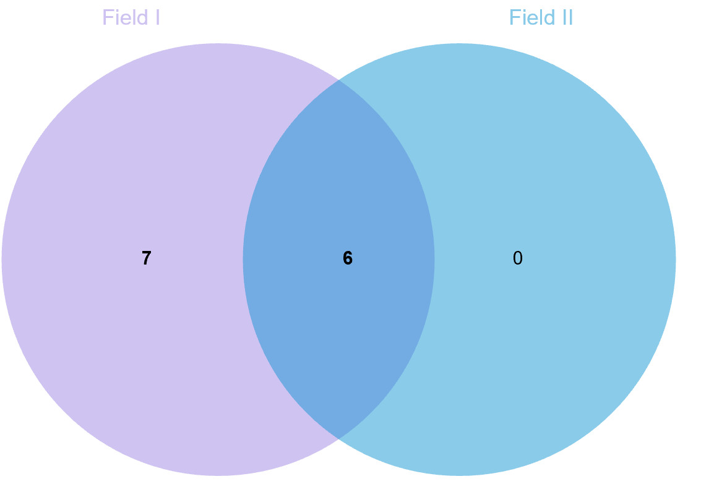
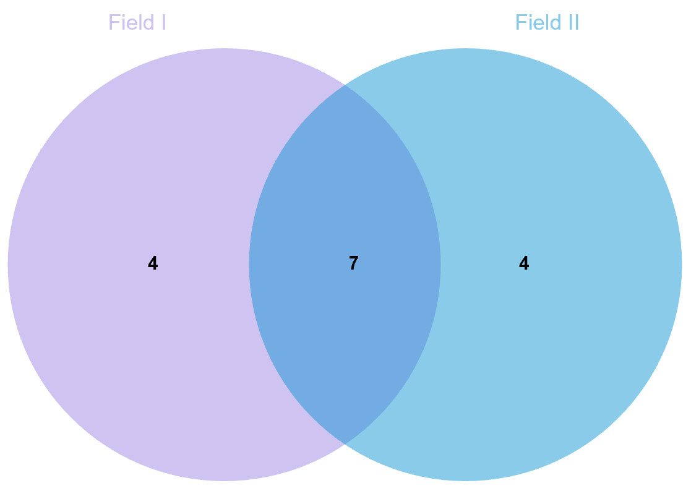

```{r setup, include=FALSE}
knitr::opts_chunk$set(
	echo=T, comment=NA, message=F, warning=F,
	fig.align="center", fig.width=5, fig.height=3, dpi=300)
# Clean workspace
rm(list=ls()) 
source("http://210.75.224.110/stat_plot_functions.R")
w=89
h=59
```

## A-B. Overlap of bacterial genera negatively (A) or positively (B) correlated with tiller number in rice varieties grown in the two test fields. 

```{r}
LN = read.table("../data/cultivar_LN_genus_cor_tiller_spearman.txt", header=T, row.names=1, sep="\t", comment.char="")
HN = read.table("../data/cultivar_HN_genus_cor_tiller_spearman.txt", header=T, row.names=1, sep="\t", comment.char="")
# Delete Unassigned
idx = rownames(LN) %in% "Unassigned"
LN = LN[!idx,]
HN = HN[!idx,]

# Select significantly correlated genus in field I/II 
LN_postive = LN[LN$FDR<0.05 & LN$rho>0,]
LN_negative = LN[LN$FDR<0.05 & LN$rho<0,]
HN_postive = HN[HN$FDR<0.05 & HN$rho>0,]
HN_negative = HN[HN$FDR<0.05 & HN$rho<0,]
suppressWarnings(write.table(paste("FieldI_postive", rownames(LN_postive),sep="\t"), file=paste("../data/genus_sig_cor_list.txt",sep = ""), append = F, sep="\t", quote=F, row.names=F, col.names=F))
suppressWarnings(write.table(paste("FieldI_negative", rownames(LN_negative),sep="\t"), file=paste("../data/genus_sig_cor_list.txt",sep = ""), append = T, sep="\t", quote=F, row.names=F, col.names=F))
suppressWarnings(write.table(paste("FieldII_postive", rownames(HN_postive),sep="\t"), file=paste("../data/genus_sig_cor_list.txt",sep = ""), append = T, sep="\t", quote=F, row.names=F, col.names=F))
suppressWarnings(write.table(paste("FieldII_negative", rownames(HN_negative),sep="\t"), file=paste("../data/genus_sig_cor_list.txt",sep = ""), append = T, sep="\t", quote=F, row.names=F, col.names=F))
```

Visualized in http://www.ehbio.com/test/venn/#/

Save figure as venn_fieldLH_Negative.svg/csv


Overlap of bacterial genera negatively (A)


Overlap of bacterial genera positively (B)

```{r}
# Select overlap part
idx = (LN$FDR < 0.05 & HN$FDR < 0.05) & (LN$rho * HN$rho > 0)
table(idx)

LN$env = "Positive"
LN[LN$rho<0,]$env = "Negative"
colnames(LN)[1] = "CorType"
table(LN[idx,]$CorType)
# save list
write.table("OTUID\t", file=paste("../data/genus_list_1sig_simCor_2dot.txt",sep = ""), append = F, sep="\t", quote=F,  eol = "",row.names=F, col.names=F)
suppressWarnings(write.table(LN[idx,], file=paste("../data/genus_list_1sig_simCor_2dot.txt",sep = ""), append = T, sep="\t", quote=F, row.names=T, col.names=T))
```

## 3D. Heatmap showing the patterns of z-scored relative abundances of root bacterial genera

```{r}
genus = read.table(paste("../data/cultivar_LN_genus.txt",sep=""), header=T, row.names=1, sep="\t", comment.char="")
# norm to %
genus = as.data.frame(t(t(genus)/colSums(genus,na=T)*100))
mean(colSums(genus)) 
pheno = read.table("../data/cultivar_LN_pheno.txt", header=T, row.names=1, sep="\t", comment.char="")

cor = read.table("../data/cultivar_LN_genus_cor_tiller_spearman.txt", header=T, row.names=1, sep="\t", comment.char="")
cor_list = read.table("../data/genus_list_1sig_simCor_2dot.txt", header=T, row.names=1, sep="\t", comment.char="")
cor = cor[rownames(cor_list),]

# Classify cor
cor$rhotype = "Positive"
cor[cor$rho<0,]$rhotype = "Negtive"
cor$sigcolor = "Nosig"
cor[cor$FDR<0.05,]$sigcolor = "*"
cor[cor$FDR<0.01,]$sigcolor = "**"
cor[cor$FDR<0.001,]$sigcolor = "***"
cor$OTUID = rownames(cor)

# save table
write.table("Genus\t", file=paste("3c_cor.txt",sep = ""), append = F, sep="\t", quote=F,  eol = "",row.names=F, col.names=F)
suppressWarnings(write.table(cor, file=paste("3c_cor.txt",sep = ""), append = T, sep="\t", quote=F, row.names=T, col.names=T))

# Select cor genus
df = genus[rownames(cor),]
metadata = read.table(paste("../data/cultivar_LN_metadata.txt",sep = ""), header=T, row.names=1, sep="\t", comment.char="")
idx = rownames(metadata) %in% colnames(genus)
metadata = metadata[idx,]
df = df[,rownames(metadata)]

# group by tiller number ranger
merge = cbind(t(df), metadata[,"tiller_cat", drop=F])
tiller_cat = merge %>% group_by(tiller_cat) %>% summarise_all(mean)
tiller_cat = as.data.frame(tiller_cat)
rownames(tiller_cat) = tiller_cat[,1]
tiller_cat = as.data.frame(t(tiller_cat[,-1]))

# Sort by abundance
cor = as.data.frame(dplyr::arrange(cor, rhotype, desc(mean)))
rownames(cor) = cor$OTUID
cor$OTUID = factor(cor$OTUID, levels = rownames(cor))

# plot heatmap
p = pheatmap(tiller_cat[rownames(cor),], cluster_rows = F, cluster_cols = F, scale = "row",
         annotation_row = cor[, c("rho", "mean","rhotype")])
pheatmap(tiller_cat[rownames(cor),], cluster_rows = F, cluster_cols = F, scale = "row",
          border_color = "NA", # annotation_row = cor[, c("rho", "mean","rhotype")],
         filename = "3d.LN_genus_abundaceVStiller.pdf", fontsize = 8, width = h/25.4*1.8, height = h/25.4*1.5*0.97)
table(cor$rhotype)
# save table
write.table("Genus\t", file=paste("3d_heatmap.txt",sep = ""), append = F, sep="\t", quote=F,  eol = "",row.names=F, col.names=F)
suppressWarnings(write.table(tiller_cat[rownames(cor),], file=paste("3d_heatmap.txt",sep = ""), append = T, sep="\t", quote=F, row.names=T, col.names=T))
```

## 3C. Bar plots showing the Spearman correlation efficiency of 13 abundant root bacterial genera significantly correlated with rice tiller number 

```{r}
library(dplyr)
tax = read.table("../data/taxonomy.txt", header=T, row.names =1, sep="\t", comment.char="", stringsAsFactors = F)
# Split Proteobacteria phylum into class
idx = tax$Phylum %in% "Proteobacteria"
tax[idx,]$Phylum = tax[idx,]$Class
# Select Phylum-Genus
tax =  tax[,c(2,6)]
# Dereplicate, 5K into 5 hundard
tax = dplyr::distinct(tax)
# Select correlated genus 
idx =  tax$Genus %in% rownames(cor) 
tax = tax[idx,]
tax = rbind(tax, c("Unassigned", "Unassigned"))
rownames(tax) = tax$Genus

# reorder
cor = as.data.frame(dplyr::arrange(cor, desc(rhotype), mean))
rownames(cor) = cor$OTUID
cor$OTUID = factor(cor$OTUID, levels = rownames(cor))
cor$Phylum = tax[rownames(cor),]$Phylum

# plot RA of genus
(p = ggplot(cor, aes(x = OTUID, y=mean, fill=Phylum)) +   geom_bar(stat = "identity") + 
  coord_flip() + main_theme + theme(legend.position = "right") + xlab("Genus") + ylab("Relative abundance (%)"))
ggsave(paste("3c.LN_genus_abundance_tax.pdf", sep=""), p, width = w*1.3, height = h*1.51, units = "mm")

# plot cor
(p = ggplot(cor, aes(x = OTUID, y=rho, fill=rhotype)) +   geom_bar(stat = "identity") + 
  coord_flip() + main_theme+ theme(legend.position = "none")+ xlab("Genus"))
ggsave(paste("3c.LN_genus_cor.pdf", sep=""), p, width = w*0.75, height = h*1.5, units = "mm")

min(cor$mean)
max(cor$mean)
write.table("OTUID\t", file=paste("3c.LN_genus_tax_cor.txt",sep = ""), append = F, sep="\t", quote=F,  eol = "",row.names=F, col.names=F)
suppressWarnings(write.table(cor, file=paste("3c.LN_genus_tax_cor.txt",sep = ""), append = T, sep="\t", quote=F, row.names=T, col.names=T))
```