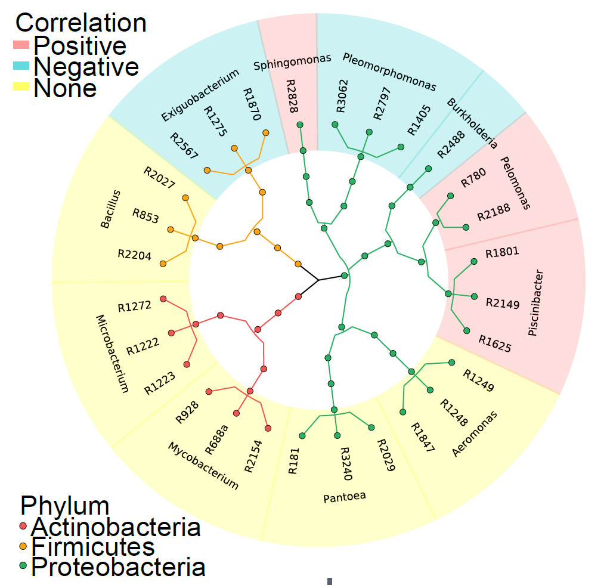

```{r setup, include=FALSE}
knitr::opts_chunk$set(
	echo=T, comment=NA, message=F, warning=F,
	fig.align="center", fig.width=5, fig.height=3, dpi=300)
# Clean workspace
rm(list=ls()) 
source("stat_plot_functions.R")
w=89
h=59
size=8
```

# Figure 4. Synthetic communities and individual bacterial isolates play causal roles in regulating rice tillering

## 4A.Cladogram showing 28 strains in this study

The plotting script following our previous study in Nature Biotechnology(doi: 10.1038/s41587-019-0104-4). Detail in https://github.com/YongxinLiu/Note/tree/master/R/format2graphlan

The data in supplementary table.



(A) Illustration of 28 taxonomically diverse isolates in bacterial genera that positively, negatively, and non-significantly correlated with rice tiller number. The tree branches are colored according to the taxonomy, while the background colors indicate the correlation with tiller numbers.

## 4B. SynComs with positively correlated bacteria increased by three or ten times promoted tiller numbers

```{r}
RawData = read.table("dataForFig4B.csv", header=T, sep=",")
index = RawData
#calculate plot data
colnames(index)[2:9] <- c(11,16,21,26,31,36,42,47)
index = melt(index, id.vars = c("GroupID"), variable.name = "GrowthTime", value.name = "TillerNumber")
index = index[, c("GroupID", "GrowthTime", "TillerNumber")]
BacList = c("Positive10FoldSynCom", "Positive3FoldSynCom", "EqualAmountSynCom", "Negative3FoldSynCom", "Negative10FoldSynCom")
index = index[index$GroupID %in% BacList,]
index$GroupID = factor(index$GroupID, levels = c("Positive10FoldSynCom", "Positive3FoldSynCom", "EqualAmountSynCom", "Negative3FoldSynCom", "Negative10FoldSynCom"))
ForPlot = summarySE(index, measurevar = "TillerNumber", groupvars=c("GroupID", "GrowthTime"))
ForPlot$GrowthTime=as.numeric(as.character(ForPlot$GrowthTime))
#statistics
SigTableFinnal = t(as.data.frame(c("Days", "group2", "method", "p", "padjFDR"))) 
colnames(SigTableFinnal) = c("Days", "group2", "method", "p", "padjFDR")
SigTableFinnal = SigTableFinnal[-1,]
Days = c("TillerNumber11D", "TillerNumber16D", "TillerNumber21D", "TillerNumber26D", "TillerNumber31D", "TillerNumber36D", "TillerNumber42D", "TillerNumber47D")
for (daynumber in Days){
  ForSig = RawData
  ForSig = ForSig[ForSig$GroupID %in% BacList,]
  ForSig$GroupID = factor(ForSig$GroupID, levels = c("Positive10FoldSynCom", "Positive3FoldSynCom", "EqualAmountSynCom", "Negative3FoldSynCom", "Negative10FoldSynCom"))
  ForSig = ForSig[, c("GroupID", daynumber)]
  colnames(ForSig)[2] = "TillerNumber"
  WilcoxtestResult = compare_means(TillerNumber ~ GroupID, data = ForSig, method = "wilcox.test", paired = F,)
  colnames(ForSig)[2] = daynumber
  WilcoxtestResult$.y. = daynumber
  WilcoxtestResult = as.data.frame(WilcoxtestResult)
  WilcoxtestResult$group3 = WilcoxtestResult$group1
  WilcoxtestResult$group4 = WilcoxtestResult$group2
  Delete = c()
  for (n in 1:length(WilcoxtestResult[,1])){
    if ("EqualAmountSynCom" %in% WilcoxtestResult$group1[n]){
    }else{if ("EqualAmountSynCom" %in% WilcoxtestResult$group2[n]){
      WilcoxtestResult$group1[n] = WilcoxtestResult$group4[n]
      WilcoxtestResult$group2[n] = WilcoxtestResult$group3[n]
    }else{Delete = append(n, Delete)}
    }
  }
  WilcoxtestResult = WilcoxtestResult[(-1)*Delete,] 
  WilcoxtestResult$padjFDR = p.adjust(WilcoxtestResult$p, method = "fdr", n = length(WilcoxtestResult$p))
  colnames(WilcoxtestResult)[1] = "Days"
  WilcoxtestResult = WilcoxtestResult[, c("Days", "group2", "method", "p", "padjFDR")]
  SigTableFinnal = merge(SigTableFinnal, WilcoxtestResult, all =T) 
}
for (padjmethod in c("p", "padjFDR")){
  asterisk = paste(padjmethod, "Asterisk", sep = "")
  for (m in 1:length(SigTableFinnal[,1])){
    ifelse (SigTableFinnal[[padjmethod]][m] < 0.001,
            SigTableFinnal[[asterisk]][m] <- "***",
            ifelse (SigTableFinnal[[padjmethod]][m] < 0.01,
                    SigTableFinnal[[asterisk]][m] <- "**",
                    ifelse (SigTableFinnal[[padjmethod]][m] < 0.05,
                            SigTableFinnal[[asterisk]][m] <- "*", SigTableFinnal[[asterisk]][m] <- "")))
  }
}
write.table(SigTableFinnal, file="StatisticsResultForFig4B.csv",append = F, quote = F, sep = ",", row.names = F, col.names = T)
padjmethod = "padjFDRAsterisk"
SigTableFinnal$GroupID = SigTableFinnal$group2
library(stringr)
SigTableFinnal$Days = str_replace(SigTableFinnal$Days, "TillerNumber", "")
SigTableFinnal$Days = str_replace(SigTableFinnal$Days, "D", "")
SigTableFinnal$GrowthTime = SigTableFinnal$Days
SigTableFinnal$asterisk = SigTableFinnal[[padjmethod]]
SigTableFinnal = SigTableFinnal[,c("GroupID", "GrowthTime", "asterisk")]
ForPlot = merge(ForPlot, SigTableFinnal, all = T)
ForPlot$padjmethod = padjmethod
write.table(ForPlot, file="SampleInformationForFig4B.csv",append = F, quote = F, sep = ",", row.names = F, col.names = T)
#save plot
p = ggplot(ForPlot, aes(x = GrowthTime, y = TillerNumber, colour = GroupID, shape = GroupID)) +
  geom_point(shape=16, size=1) +
  geom_line(size=0.5) +
  labs(x=paste("GrowthTime(Days)"), y="TillerNumber") +
  geom_errorbar(aes(ymin = TillerNumber, ymax = TillerNumber+se), width = 0.5) +
  geom_text(data=ForPlot, aes(x=GrowthTime, y= TillerNumber+0.1, label= asterisk),show.legend = FALSE, color="black") +
  expand_limits(x=25,y = 0)+
  theme(
    plot.background=element_rect(fill="#FFFFFF"), 
    panel.background = element_blank(), 
    panel.grid.major.x = element_blank(),
    panel.grid.major.y = element_blank(), 
    panel.grid.minor.x = element_blank(), 
    panel.grid.minor.y = element_blank(),
    panel.border = element_blank(), 
    axis.title = element_text(size=10),  
    axis.text.x = element_text(size=8,angle=45,vjust=1,hjust=1), 
    axis.line = element_line(colour="#57606f"),
    legend.title = element_blank(),
    legend.key = element_rect(fill="#FFFFFF"),
    legend.position = "right"
  ) +
  scale_color_manual(values = c("#D73027","#E1857A","#555555","#2A93D9","#313695"))
p
ggsave(p, filename = "Fig4B.png", width = 5.5, height = 3)
ggsave(p, filename = "Fig4B.pdf", width = 5.5, height = 3)
```

(B) SynComs with positively correlated bacteria increased by three or ten times promoted tiller numbers of wild-type Nipponbare rice, while SynComs with negatively correlated bacteria increased by three to ten times showed inhibitory effects (FDR adjusted P < 0.05, Wilcoxon rank sum test). The effects are shown in a time-series manner. The plot includes combined data from two experiments with independent inoculation; each treatment included 22 to 24 individual plants. Error bars represent standard errors.

## 4C/D. Z-scored distributions (C) and numbers (D) of Nipponbare tillers after inoculation of individual isolates

```{r Z-scored distributions}
#read input files
RawData = read.table("dataForFig4CD.csv", header=T, sep=",")
#Plot
ForPlot = RawData
ForPlot$GroupID = factor(ForPlot$GroupID, levels = c("R1625","R2149","R1801","R2828","R2188","R780","R3062","R2797","R1405","R2488","R1870","R1275","R2567","Mock"))
library(RColorBrewer)
Colormap <- brewer.pal(11,"RdYlBu") 
Colormap <- rev(Colormap)
library(ggridges)
#save plot
p = ggplot(ForPlot, aes(x = Z_Score, y = GroupID, fill = stat(x))) + 
    geom_density_ridges_gradient(scale = 3, rel_min_height = 0.01) +
    scale_fill_gradientn(colours = Colormap) +
    theme_ridges(grid = FALSE) +
    theme(
      plot.background = element_rect(fill = "#FFFFFF"), 
      panel.background = element_blank(), 
      panel.grid.major.x = element_blank(),
      panel.grid.major.y = element_blank(), #主网格线
      panel.grid.minor.x = element_blank(), #次网格线
      panel.grid.minor.y = element_blank(),
      panel.border = element_blank(), #边框
      axis.title = element_text(size = 10),  #轴标题
      axis.text.x = element_text(size = 8, angle = 45, vjust = 1, hjust = 1), #文本
      axis.line = element_line(colour = "#57606f"),
      legend.title = element_blank(),
      legend.key = element_rect(fill = "#FFFFFF"),
      legend.position = "none"
    )
p
ggsave(p,filename=paste("Fig4C.pdf"), width=5.5, height=3.8)
ggsave(p,filename=paste("Fig4C.png"), width=5.5, height=3.8)
```

```{r numbers}
#read input files
RawData = read.table("dataForFig4CD.csv", header=T, sep=",")
#calculate plot data
phenotype = "TillerNumber"
ForPlot <- summarySE(RawData, measurevar = phenotype, groupvars ="GroupID")
ForPlot$GroupID = factor(ForPlot$GroupID, levels = c("R1625","R2149","R1801","R2828","R2188","R780","R3062","R2797","R1405","R2488","R1870","R1275","R2567","Mock"))
#statistics
SigTableFinnal = t(as.data.frame(c("group2", "method", "p", "padjFDR"))) 
colnames(SigTableFinnal) = c("group2", "method", "p", "padjFDR")
SigTableFinnal = SigTableFinnal[-1,]
#Wilcox.test
ForSig = RawData
ForSig = ForSig[, c("GroupID", phenotype)]
colnames(ForSig)[2] = "y"
WilcoxtestResult = compare_means(y ~ GroupID, data = ForSig, method = "wilcox.test", paired = F,)
colnames(ForSig)[2] = phenotype
WilcoxtestResult = as.data.frame(WilcoxtestResult)
WilcoxtestResult$group3 = WilcoxtestResult$group1
WilcoxtestResult$group4 = WilcoxtestResult$group2
Delete = c()
for (n in 1:length(WilcoxtestResult[,1])){
  if ("Mock" %in% WilcoxtestResult$group1[n]){
  }else{if ("Mock" %in% WilcoxtestResult$group2[n]){
    WilcoxtestResult$group1[n] = WilcoxtestResult$group4[n]
    WilcoxtestResult$group2[n] = WilcoxtestResult$group3[n]
  }else{Delete = append(n, Delete)}
  }
}
WilcoxtestResult = WilcoxtestResult[(-1)*Delete,] 
WilcoxtestResult$padjFDR = p.adjust(WilcoxtestResult$p, method = "fdr", n = length(WilcoxtestResult$p))
WilcoxtestResult = WilcoxtestResult[, c("group2", "method", "p", "padjFDR")]
SigTableFinnal = WilcoxtestResult
for (padjmethod in c("p", "padjFDR")){
  asterisk = paste(padjmethod, "Asterisk", sep = "")
  for (m in 1:length(SigTableFinnal[,1])){
    ifelse (SigTableFinnal[[padjmethod]][m] < 0.001,
            SigTableFinnal[[asterisk]][m] <- "***",
            ifelse (SigTableFinnal[[padjmethod]][m] < 0.01,
                    SigTableFinnal[[asterisk]][m] <- "**",
                    ifelse (SigTableFinnal[[padjmethod]][m] < 0.05,
                            SigTableFinnal[[asterisk]][m] <- "*", SigTableFinnal[[asterisk]][m] <- "")))
  }
}
write.table(SigTableFinnal, file="StatisticsResultForFig4D.csv",append = F, quote = F, sep = ",", row.names = F, col.names = T)
padjmethod = "padjFDRAsterisk"
SigTableFinnal$GroupID = SigTableFinnal$group2
SigTableFinnal$asterisk = SigTableFinnal[[padjmethod]]
SigTableFinnal = SigTableFinnal[,c("GroupID", "asterisk")]
ForPlot = merge(ForPlot, SigTableFinnal, all = T)
ForPlot$padjmethod = padjmethod
write.table(ForPlot, file="SampleInformationForFig4D.csv",append = F, quote = F, sep = ",", row.names = F, col.names = T)
#prepare data for plot
ForPlot = merge(ForPlot, SigTableFinnal, all = T)
ForPlot$max = (ForPlot$TillerNumber + ForPlot$se)*1.2
#save data
p = ggplot(data = ForPlot, mapping = aes(x = GroupID, y = .data[[phenotype]], fill = GroupID)) + 
  labs(x = "", y="TillerNmuber")  +
  scale_fill_manual(values = c("#fb8d81","#fb8d81","#fb8d81","#fb8d81","#fb8d81","#fb8d81","#00c8ce","#00c8ce","#00c8ce","#00c8ce","#00c8ce","#00c8ce","#00c8ce","#888888")) +
  geom_bar(stat = "identity", width = 0.8) +
  geom_errorbar(aes(ymin = .data[[phenotype]], ymax = .data[[phenotype]] + se), width = .1) +
  geom_text(aes(x = GroupID, y = max, label = asterisk)) +
  coord_flip() + 
  theme(
    plot.background = element_rect(fill = "#FFFFFF"), 
    panel.background = element_blank(), 
    panel.grid.major.x = element_blank(),
    panel.grid.major.y = element_blank(), 
    panel.grid.minor.x = element_blank(), 
    panel.grid.minor.y = element_blank(),
    panel.border = element_blank(), 
    axis.title = element_text(size = 9),  
    axis.text.x = element_text(size = 9, angle = 0, vjust = 0, hjust = 0), 
    axis.line = element_line(colour = "#57606f"),
    legend.title = element_blank(),
    legend.key = element_rect(fill = "#FFFFFF"),
    legend.position = "none"
  )
p
ggsave(p,filename = "Fig4D.pdf", width = 3, height = 3.8)
ggsave(p,filename = "Fig4D.png", width = 3, height = 3.8)
```
(C-D) Z-scored distributions (C) and numbers (D) of Nipponbare tillers after inoculation of individual isolates in tiller-related genera used in the SynComs. Note that individual bacterial isolates in all six tiller-related genera influence rice tiller number (FDR adjusted P < 0.05, Wilcoxon rank sum test). Bar plots showing combined data from two independent inoculation experiments under hydroponic conditions; each treatment included 20 to 24 individual plants. Error bars represent standard errors.

## 4E. Isolates and SynComs promoted or inhibited rice tiller number in the field

```{r Isolates and SynComs}
#read input files
RawData = read.table("dataForFig4E.csv", header=T, sep=",")
phenotype = "TillerNumber"
#calculate plot data
ForPlot <- summarySE(RawData, measurevar = phenotype, groupvars ="GroupID")
ForPlot$GroupID = factor(ForPlot$GroupID, levels = c("Mock", "R2567", "R2488", "R1405", "NegativeSynCom", "R780", "R2828", "R1801", "PositiveSynCom"))
#statistics
SigTableFinnal = t(as.data.frame(c("group2", "method", "p", "padjFDR"))) 
colnames(SigTableFinnal) = c("group2", "method", "p", "padjFDR")
SigTableFinnal = SigTableFinnal[-1,]
#Wilcox.test循环----
ForSig = RawData
ForSig = ForSig[, c("GroupID", phenotype)]
colnames(ForSig)[2] = "y"
WilcoxtestResult = compare_means(y ~ GroupID, data = ForSig, method = "wilcox.test", paired = F,)
colnames(ForSig)[2] = phenotype
WilcoxtestResult = as.data.frame(WilcoxtestResult)
WilcoxtestResult$group3 = WilcoxtestResult$group1
WilcoxtestResult$group4 = WilcoxtestResult$group2
Delete = c()
for (n in 1:length(WilcoxtestResult[,1])){
  if ("Mock" %in% WilcoxtestResult$group1[n]){
  }else{if ("Mock" %in% WilcoxtestResult$group2[n]){
    WilcoxtestResult$group1[n] = WilcoxtestResult$group4[n]
    WilcoxtestResult$group2[n] = WilcoxtestResult$group3[n]
  }else{Delete = append(n, Delete)}
  }
}
WilcoxtestResult = WilcoxtestResult[(-1)*Delete,] 
WilcoxtestResult$padjFDR = p.adjust(WilcoxtestResult$p, method = "fdr", n = length(WilcoxtestResult$p))
WilcoxtestResult = WilcoxtestResult[, c("group2", "method", "p", "padjFDR")]
SigTableFinnal = WilcoxtestResult
for (padjmethod in c("p", "padjFDR")){
  asterisk = paste(padjmethod, "Asterisk", sep = "")
  for (m in 1:length(SigTableFinnal[,1])){
    ifelse (SigTableFinnal[[padjmethod]][m] < 0.001,
            SigTableFinnal[[asterisk]][m] <- "***",
            ifelse (SigTableFinnal[[padjmethod]][m] < 0.01,
                    SigTableFinnal[[asterisk]][m] <- "**",
                    ifelse (SigTableFinnal[[padjmethod]][m] < 0.05,
                            SigTableFinnal[[asterisk]][m] <- "*", SigTableFinnal[[asterisk]][m] <- "")))
  }
}
write.table(SigTableFinnal, file="StatisticsResultForFig4E.csv",append = F, quote = F, sep = ",", row.names = F, col.names = T)
padjmethod = "padjFDRAsterisk"
SigTableFinnal$GroupID = SigTableFinnal$group2
SigTableFinnal$asterisk = SigTableFinnal[[padjmethod]]
SigTableFinnal = SigTableFinnal[,c("GroupID", "asterisk")]
#prepare data for plot
ForPlot = merge(ForPlot, SigTableFinnal, all = T)
ForPlot$padjmethod = padjmethod
write.table(ForPlot, file="SampleInformationForFig4E.csv",append = F, quote = F, sep = ",", row.names = F, col.names = T)
ForPlot = merge(ForPlot, SigTableFinnal, all = T)
ForPlot$max = (ForPlot$TillerNumber + ForPlot$se)*1.2
#save plot
p = ggplot(data = ForPlot, aes(x = GroupID, y = .data[[phenotype]], fill = GroupID)) +
  geom_bar(stat = "identity", width = 0.8) +
  geom_errorbar(aes(ymin = .data[[phenotype]], ymax = .data[[phenotype]]+se), width = .1) +
  geom_text(aes(x = GroupID, y = max, label = asterisk)) +
  scale_fill_manual(values = c("#888888", "#00c8ce", "#00c8ce", "#00c8ce", "#00c8ce", "#fb8d81", "#fb8d81", "#fb8d81", "#fb8d81")) +
  theme(
    plot.background = element_rect(fill = "#FFFFFF"), 
    panel.background = element_blank(), 
    panel.grid.major.x = element_blank(),
    panel.grid.major.y = element_blank(), #主网格线
    panel.grid.minor.x = element_blank(), #次网格线
    panel.grid.minor.y = element_blank(),
    panel.border = element_blank(), #边框
    axis.title = element_text(size = 10),  #轴标题
    axis.text.x = element_text(size = 8, angle = 45, vjust = 1, hjust = 1), #文本
    axis.line = element_line(colour = "#57606f"),
    legend.title = element_blank(),
    legend.key = element_rect(fill = "#FFFFFF"),
    legend.position = "none"
  )

p = p + theme(axis.text.x = element_text(angle = 45, vjust = 1, hjust = 1))
p
ggsave(p, filename = "Fig4E.pdf", width = 5.5, height = 3)
ggsave(p, filename = "Fig4E.png", width = 5.5, height = 3)
```

(E) Consistent with the laboratory results, individual bacterial isolates and their combined SynComs significantly promoted or inhibited rice tiller number under the field condition (FDR adjusted P < 0.05, Wilcoxon rank sum test). Each treatment included 13 to 20 individual plants. Statistical significance between the mock control and bacterial treatment is indicated by *** (P < 0.001), ** (P < 0.01), and * (P < 0.05).

