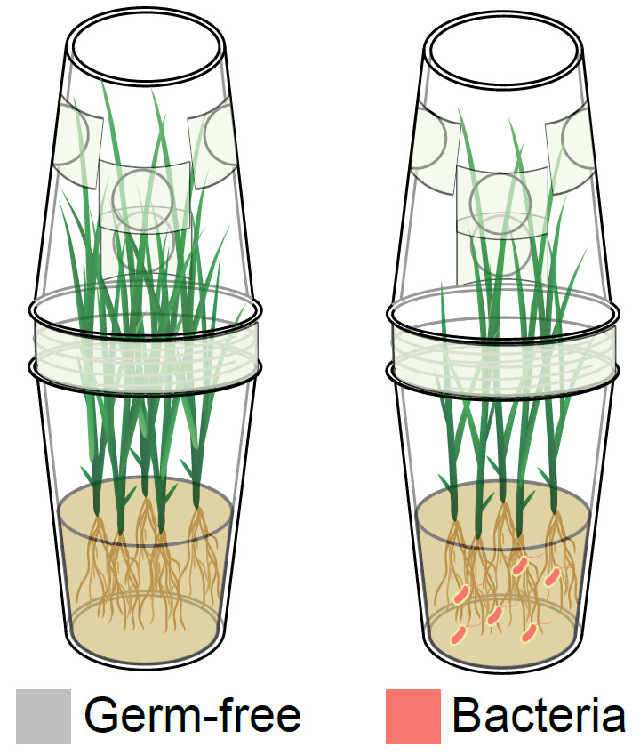

```{r setup, include=FALSE}
knitr::opts_chunk$set(
	echo=T, comment=NA, message=F, warning=F,
	fig.align="center", fig.width=5, fig.height=3, dpi=300)
# Clean workspace
rm(list=ls()) 
source("http://210.75.224.110/stat_plot_functions.R")
dir.create("fig4", showWarnings=F)
w=89
h=59
size=8
```

## 4A. Diagram illustrating germ-free rice with and without bacterial inoculation.

This drawing is hand-drawn and drawn using Adobe Illustrator.



## 4B. Tiller number of germ-free Nipponbare rice and rice inoculated with bacteria that were negatively (red) and positively (blue) correlated with tiller number

```{r}
df=read.table("4b.TillerNumber.txt", header=T, row.names=NULL, sep="\t", comment.char="")
df$GroupID=factor(df$GroupID, levels=c("GF","R2567","R2488","R1405","R2149","R2828"))

library(amplicon)
index="AdjustTillerNumber"
groupID= "GroupID"

df=df[,c( index, groupID)]
df=na.omit(df)
colnames(df)[1:2]=c(index, "group")
model=aov(df[[index]] ~ group, data=df)
Tukey_HSD=TukeyHSD(model, ordered=TRUE, conf.level=0.95)
Tukey_HSD_table=as.data.frame(Tukey_HSD$group)
write.table(paste(date(), "\nGroup\t", groupID, "\n\t", sep=""), file=paste("4b.TukeyHSD.txt", sep=""), append=F, quote=F, eol="", row.names=F, col.names=F)
suppressWarnings(write.table(Tukey_HSD_table, file=paste("4b.TukeyHSD.txt", sep=""), append=T, quote=F, sep="\t", eol="\n", na="NA", dec=".", row.names=T, col.names=T))
generate_label_df=function(TUKEY, variable) {
    Tukey.levels=TUKEY[[variable]][, 4]
    Tukey.labels=data.frame(multcompLetters(Tukey.levels)["Letters"])
    Tukey.labels$group=rownames(Tukey.labels)
    Tukey.labels=Tukey.labels[order(Tukey.labels$group),]
    return(Tukey.labels)
}
library(multcompView)
LABELS=generate_label_df(Tukey_HSD, "group")
df$stat=LABELS[as.character(df$group), ]$Letters
max=max(df[, c(index)])
min=min(df[, index])
x=df[, c("group", index)]
y=x %>% group_by(group) %>% summarise_(Max=paste("max(", index, ")", sep=""))
y=as.data.frame(y)
rownames(y)=y$group
df$y=y[as.character(df$group), ]$Max + (max - min) * 0.05

color = c("grey","#F8766D","#00BFC4")

# Add strain metadata
wet=read.table("../data/wet_strain_metadata.txt", header=T, row.names=NULL, sep="\t", comment.char="")
merged = merge(df, wet, by.x="group",by.y="StockID", all.x = T)
df=merged

# Add enter in ID
swr = function(string, nwrap = 12){
  paste(strwrap(string,width = nwrap),collapse = "\n")
}
swr = Vectorize(swr)
df$FullName <- swr(df$FullName)

# Manual set label
unique(df$FullName)
df$FullName = factor(df$FullName, levels = c("Germ free","Exiguobacterium\nR2567","Burkholderia\nR2488","Pleomorphomonas\nR1405","Piscinibacter\nR2149","Pelomonas\nR2828"))

p=ggplot(df, aes(x=FullName, y=.data[[index]], color=Correlation)) + # x=group
    geom_boxplot(alpha=1, outlier.shape=NA, outlier.size=0, 
        size=0.7, width=0.5, fill="transparent") + 
    labs(x="Groups", y=paste(index, "index"), color=groupID) + theme_classic() + geom_text(data=df, 
    aes(x=FullName, y=y, label=stat)) +  # color=group, 
    geom_jitter(position=position_jitter(0.17), size=1, 
        alpha=0.7) + theme(text=element_text(family="sans", 
    size=7))
p=p+theme_bw()+theme(axis.text.x=element_text(angle=45,vjust=1, hjust=1)) + theme(legend.position="NA")
(p = p + scale_fill_manual(values = color))

# Plot barplot + errorbar
# Calculate mean + standard error
df2 <- summarySE(df, measurevar=index, groupvars="group")
df_stat=unique(df[,c("group","stat","y","Correlation","FullName")])
idx=match(df_stat$group, df2$group)
df2=df2[idx,]
df2=cbind(df2, df_stat)[,-1]
df2$max=df2[[index]]+df2$se+0.06*max(df2[[index]])
p=ggplot(data=df2, aes(x=FullName, y=.data[[index]], fill=Correlation)) + 
    geom_bar(stat="identity", width=0.8) + 
    labs(x="", y=paste("Tiller number"), color=groupID) + theme_classic() +
    # geom_text(data=df2, aes(x=group, y=y, label=stat)) +  
    geom_errorbar(aes(ymin=.data[[index]]-se, ymax=.data[[index]]+se), width=.1) +
    geom_text(data=df2, aes(x=FullName, y=max, label= stat)) +
    geom_text(aes(label=round(.data[[index]],2), y=.data[[index]]/2), position=position_dodge(0.9), vjust=0,color="#dfe6e9")
p=p+main_theme+theme(axis.text.x=element_text(angle=45,vjust=1, hjust=1))
(p = p + scale_fill_manual(values = color))
ggsave(paste0("4b.", index,"_se_bar.pdf"), p, width=w*1.3, height=h*1.1, units="mm")
```

## 4C. Heatmap showing the log2 transformed fold change of RNA expression of tiller-related genes in the shoot base of Nipponbare rice inoculated with Exiguobacterium R2567, Burkholderia R2488, or Pleomorphomonas R1405 compared to germ-free rice

```{r}
library(pheatmap)
library(RColorBrewer)

data <- read.table(file="logFC_SL", sep="\t", header=T, row.names=1, check.names=F, quote="", comment="")
data_row <- read.table(file="SL.gene.logFC.symbol", sep="\t", header=T, row.names=1, check.names=F, quote="", comment="")
rownames(data) = data_row[rownames(data),]
colnames(data) = c("Pleomorphomonas R1405","Burkholderia R2488","Exiguobacterium R2567")

# log2(fold change) to fold change, more than abs(4) as 4
df = 2^data
df[df<1] = 1/df[df<1]*(-1)
fc=4
df[df>fc] = fc
df[df<(-1)*fc] = (-1)*fc
data = df
data = data[,c("Exiguobacterium R2567","Burkholderia R2488","Pleomorphomonas R1405")]

pheatmap(t(data), kmean_k=NA, # color=color_vector, # [round(abs(min(data)/max(data)*50)):100]
    scale="none", border_color=NA,
    treeheight_row = 15, treeheight_col = 30,
    cluster_rows=F, cluster_cols=T,
    # breaks=legend_breaks, 
    clustering_method="complete",
    clustering_distance_rows="correlation",
    clustering_distance_cols="correlation",
    legend_breaks=c(-4:4),
    legend_labels=c(-4:4),# show_rownames=TRUE, show_colnames=TRUE, # display_numbers=T,
    main="", # annotation_col=annotation_col, annotation_row=annotation_row, annotation_colors = ann_colors,
    fontsize=8, width=w*1.9/25.4,height=h/25.4, 
    filename="4c.logFC.pheatmap.pdf")
```