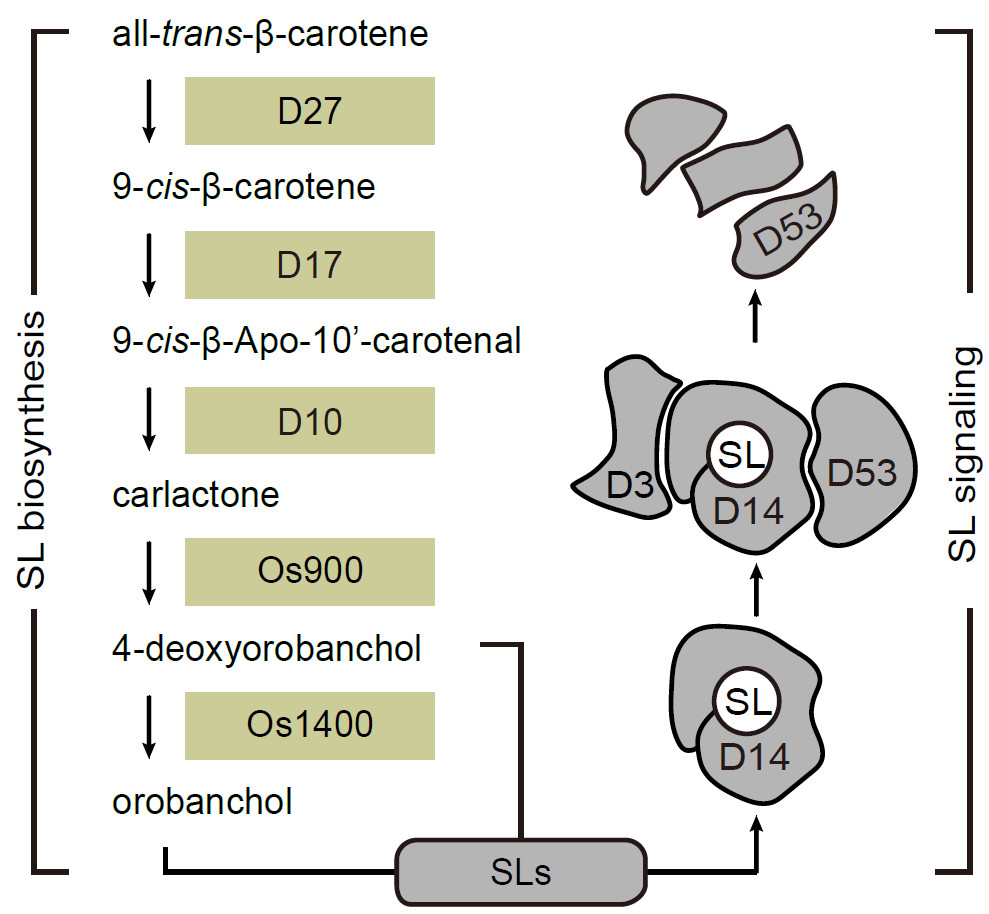

```{r setup, include=FALSE}
knitr::opts_chunk$set(
	echo=T, comment=NA, message=F, warning=F,
	fig.align="center", fig.width=5, fig.height=3, dpi=300)
# Clean workspace
rm(list=ls()) 
source("http://210.75.224.110/stat_plot_functions.R")
w=89
h=59
size=8
```

# Figure 5. Exiguobacterium R2567 and Pelomonas R780 regulate rice tillering through the strigolactone pathway

## 5A. Diagram of rice SL pathway




(A) Diagram of key proteins in the rice SL pathway. D27, D10, and D17 are responsible for SL biosynthesis. D14 is a SL receptor. D3 is a corepressor. D53 is an F-box protein that functions as a coreceptor. The d53 mutant used in this study is a dominant negative mutant repressing the SL pathway.

## 5B. Diagram shows D53 levels in different treatment

```{r cars}
library(ggpubr)
#read input files
RawData = read.table("dataForFig5B.csv", header=T, sep=",")
#calculate plot data
phenotype = "RelativeD53Level"
ForPlot <- summarySE(RawData, measurevar = phenotype, groupvars ="GroupID")
ForPlot$GroupID = factor(ForPlot$GroupID, levels = c("Mock", "R2567", "R2488", "R1405", "R780", "R2828", "R1801"))
#statistics
SigTableFinnal = t(as.data.frame(c("group2", "method", "p", "padjFDR"))) 
colnames(SigTableFinnal) = c("group2", "method", "p", "padjFDR")
SigTableFinnal = SigTableFinnal[-1,]
ForSig = RawData
ForSig = ForSig[, c("GroupID", phenotype)]
colnames(ForSig)[2] = "y"
TtestResult = compare_means(y ~ GroupID, data = ForSig, method = "t.test", paired = F,)
colnames(ForSig)[2] = phenotype
TtestResult = as.data.frame(TtestResult)
TtestResult$group3 = TtestResult$group1
TtestResult$group4 = TtestResult$group2
Delete = c()
for (n in 1:length(TtestResult[,1])){
  if ("Mock" %in% TtestResult$group1[n]){
  }else{if ("Mock" %in% TtestResult$group2[n]){
    TtestResult$group1[n] = TtestResult$group4[n]
    TtestResult$group2[n] = TtestResult$group3[n]
  }else{Delete = append(n, Delete)}
  }
}
TtestResult = TtestResult[(-1)*Delete,] 
TtestResult$padjFDR = p.adjust(TtestResult$p, method = "fdr", n = length(TtestResult$p))
TtestResult = TtestResult[, c("group2", "method", "p", "padjFDR")]
SigTableFinnal = TtestResult
for (padjmethod in c("p", "padjFDR")){
  asterisk = paste(padjmethod, "Asterisk", sep = "")
  for (m in 1:length(SigTableFinnal[,1])){
    ifelse (SigTableFinnal[[padjmethod]][m] < 0.001,
            SigTableFinnal[[asterisk]][m] <- "***",
            ifelse (SigTableFinnal[[padjmethod]][m] < 0.01,
                    SigTableFinnal[[asterisk]][m] <- "**",
                    ifelse (SigTableFinnal[[padjmethod]][m] < 0.05,
                            SigTableFinnal[[asterisk]][m] <- "*", SigTableFinnal[[asterisk]][m] <- "")))
  }
}
write.table(SigTableFinnal, file="StatisticsResultForFig5B.csv",append = F, quote = F, sep = ",", row.names = F, col.names = T)
padjmethod = "padjFDRAsterisk"
SigTableFinnal$GroupID = SigTableFinnal$group2
SigTableFinnal$asterisk = SigTableFinnal[[padjmethod]]
SigTableFinnal = SigTableFinnal[,c("GroupID", "asterisk")]
ForPlot = merge(ForPlot, SigTableFinnal, all = T)
write.table(ForPlot, file="SampleInformationForFig5B.csv",append = F, quote = F, sep = ",", row.names = F, col.names = T)
ForPlot$padjmethod = padjmethod
#prepare data for plot
ForPlot = merge(ForPlot, SigTableFinnal, all = T)
ForPlot$max = (ForPlot[[phenotype]] + ForPlot$se)*1.2
#save plot
p = ggplot(data = ForPlot, aes(x = GroupID, y = .data[[phenotype]], fill = GroupID)) +
  geom_bar(stat = "identity", width = 0.8) +
  geom_errorbar(aes(ymin = .data[[phenotype]], ymax = .data[[phenotype]]+se), width = .1) +
  geom_text(aes(x = GroupID, y = max, label = asterisk)) +
  scale_fill_manual(values = c("#888888", "#00c8ce", "#00c8ce", "#00c8ce",  "#fb8d81", "#fb8d81", "#fb8d81")) +
  theme(
    plot.background = element_rect(fill = "#FFFFFF"), 
    panel.background = element_blank(), 
    panel.grid.major.x = element_blank(),
    panel.grid.major.y = element_blank(), 
    panel.grid.minor.x = element_blank(), 
    panel.grid.minor.y = element_blank(),
    panel.border = element_blank(), 
    axis.title = element_text(size = 10),  
    axis.text.x = element_text(size = 8, angle = 45, vjust = 1, hjust = 1), 
    axis.line = element_line(colour = "#57606f"),
    legend.title = element_blank(),
    legend.key = element_rect(fill = "#FFFFFF"),
    legend.position = "none"
  )
p = p + theme(axis.text.x = element_text(angle = 45, vjust = 1, hjust = 1))
p
ggsave(p, filename = "Fig5B.pdf", width = 4, height = 2.5)
ggsave(p, filename = "Fig5B.png", width = 4, height = 2.5)
```

(B) D53 levels in wild-type Nipponbare seedlings at 3 h after treatment with bacterial exudates from Exiguobacterium R2567, Pleomorphomonas R1405, Burkholderia R2488, Pelomonas R780, Pelomonas R2188, Piscinibacter R1801, and the uninoculated mock control. D53 protein levels were determined by densitometry and normalized to ACTIN, with the mock signal set as 1.00. Error bars represent standard errors (n = 4, FDR adjusted P < 0.05, two-tailed Student’s t-test).

## 5C/D. Exiguobacterium R2567 and Pelomonas R780 affect the expression of SL biosynthesis genes

```{r}
library(tidyr)
#read input files
RawData = read.table("dataForFig5CD.csv", header=T, sep=",")
phenotype = "RelativeExpressionLevels"
genotype = c("D27", "D17", "D10", "OS900", "OS1400")
#Filter data
filter = c("R780", "R2567")
for (i in filter){
  ForPlot = RawData
  ForPlot = ForPlot[ForPlot$Filter %in% i,]
  ForPlot = ForPlot[, c("GroupID", "Genotype","Bacteria", phenotype)]
  #statistics
  ForPlot2 <- summarySE(ForPlot, measurevar = phenotype, groupvars = c("Bacteria", "Genotype"))
  ForPlot2 <- unite(ForPlot2, "GroupID", Genotype, Bacteria, sep = "_", remove = FALSE)
  ForPlot2$GroupID = factor(ForPlot2$GroupID, levels = c("D27_Mock", "D27_R2567",  "D27_R780", "D17_Mock", "D17_R2567",  "D17_R780", "D10_Mock", "D10_R2567",  "D10_R780", "OS900_Mock", "OS900_R2567",  "OS900_R780", "OS1400_Mock",  "OS1400_R2567", "OS1400_R780"))
  ForPlot2$Bacteria = factor(ForPlot2$Bacteria, levels = c("Mock", "R780", "R2567"))
  ForPlot2$Genotype = factor(ForPlot2$Genotype, levels = c("D27", "D17", "D10", "OS900", "OS1400"))
  SigTableFinnal = t(as.data.frame(c("group2", "method", "p"))) 
  colnames(SigTableFinnal) = c("group2", "method", "p")
  SigTableFinnal = SigTableFinnal[-1,]
  # t-test
  for (j in genotype){
    ForSig = ForPlot
    ForSig = ForSig[ForSig$Genotype %in% j,]
    colnames(ForSig)[4] = "y"
    TtestResult = compare_means(y ~ GroupID, data = ForSig, method = "t.test", paired = F,)
    colnames(ForSig)[4] = phenotype
    TtestResult = as.data.frame(TtestResult)
    TtestResult = TtestResult[, c("group2", "method", "p")]
    SigTableFinnal = merge(SigTableFinnal, TtestResult, all = T)
  }
  padjmethod = "p"
  asterisk = paste(padjmethod, "Asterisk", sep = "")
  for (m in 1:length(SigTableFinnal[,1])){
    ifelse (SigTableFinnal[[padjmethod]][m] < 0.001,
            SigTableFinnal[[asterisk]][m] <- "***",
            ifelse (SigTableFinnal[[padjmethod]][m] < 0.01,
                    SigTableFinnal[[asterisk]][m] <- "**",
                    ifelse (SigTableFinnal[[padjmethod]][m] < 0.05,
                            SigTableFinnal[[asterisk]][m] <- "*", SigTableFinnal[[asterisk]][m] <- "")))
  }
  write.table(SigTableFinnal, file = paste(i, "StatisticsResultForFig5CD.csv"), append = F, quote = F, sep = ",", row.names = F, col.names = T)
  write.table(ForPlot2, file = paste(i, "SampleInformationForFig5CD.csv"), append = F, quote = F, sep = ",", row.names = F, col.names = T)
  ForPlot2$max=(ForPlot2[[phenotype]]+ForPlot2$se)+0.3
  colnames(SigTableFinnal)[1] = "GroupID"
  ForPlot2 = merge(ForPlot2, SigTableFinnal, all = T)
  #save plot
  p = ggplot(data = ForPlot2, mapping = aes(x = Genotype, y = .data[[phenotype]], fill = Bacteria)) + 
      geom_bar(stat = "identity", width = 0.8, position = position_dodge(), size = 0.3) +
      geom_errorbar(aes(ymin = .data[[phenotype]], ymax = .data[[phenotype]] + se), width = .1, position = position_dodge(0.8)) +
      scale_fill_manual(values = c("#888888", "#fb8d81")) +
    #"#fb8d81"
      theme(
        plot.background=element_rect(fill = "#FFFFFF"), 
        panel.background = element_blank(), 
        panel.grid.major.x = element_blank(),
        panel.grid.major.y = element_blank(), #主网格线
        panel.grid.minor.x = element_blank(), #次网格线
        panel.grid.minor.y = element_blank(),
        panel.border = element_blank(), #边框
        axis.title = element_text(size = 10),  #轴标题
        axis.text.x = element_text(size = 8, angle = 45, vjust = 1, hjust = 1), #文本
        axis.line = element_line(colour = "#57606f"),
        legend.title = element_blank(),
        legend.key = element_rect(fill = "#FFFFFF"),
        legend.position = "none"
      )
  p=p+theme(axis.text.x=element_text(angle=45,vjust=1, hjust=1))
  p
  ggsave(p, filename = paste(i, "Fig5CD.pdf"), width = 2.7, height = 2.2)
  ggsave(p, filename = paste(i, "Fig5CD.png"), width = 2.7, height = 2.2)
}
#FRD correction
FdrCorrection = read.table("R780 StatisticsResultForFig5CD.csv", header=T, sep=",")
FdrCorrection$p = as.numeric(as.character(FdrCorrection$p))
FdrCorrection$padjFDR = p.adjust(FdrCorrection$p, method = "fdr", n = length(FdrCorrection$p))
for (padjmethod in c("p", "padjFDR")){
  asterisk = paste(padjmethod, "Asterisk", sep = "")
  for (m in 1:5){
    ifelse (FdrCorrection[[padjmethod]][m] < 0.001,
            FdrCorrection[[asterisk]][m] <- "***",
            ifelse (FdrCorrection[[padjmethod]][m] < 0.01,
                    FdrCorrection[[asterisk]][m] <- "**",
                    ifelse (FdrCorrection[[padjmethod]][m] < 0.05,
                            FdrCorrection[[asterisk]][m] <- "*", FdrCorrection[[asterisk]][m] <- "")))
  }
  
}       
write.table(FdrCorrection, file="R780 StatisticsResultForFig5CD.csv",append = F, quote = F, sep = ",", row.names = F, col.names = T)
FdrCorrection = read.table("R2567 StatisticsResultForFig5CD.csv", header=T, sep=",")
FdrCorrection$p = as.numeric(as.character(FdrCorrection$p))
FdrCorrection$padjFDR = p.adjust(FdrCorrection$p, method = "fdr", n = length(FdrCorrection$p))
for (padjmethod in c("p", "padjFDR")){
  asterisk = paste(padjmethod, "Asterisk", sep = "")
  for (m in 1:5){
    ifelse (FdrCorrection[[padjmethod]][m] < 0.001,
            FdrCorrection[[asterisk]][m] <- "***",
            ifelse (FdrCorrection[[padjmethod]][m] < 0.01,
                    FdrCorrection[[asterisk]][m] <- "**",
                    ifelse (FdrCorrection[[padjmethod]][m] < 0.05,
                            FdrCorrection[[asterisk]][m] <- "*", FdrCorrection[[asterisk]][m] <- "")))
  }
}       
write.table(FdrCorrection, file="R2567 StatisticsResultForFig5CD.csv",append = F, quote = F, sep = ",", row.names = F, col.names = T)
```

(C, D) Exiguobacterium R2567 and Pelomonas R780 affect the expression of SL biosynthesis genes. Expression levels of SL biosynthesis genes (D27, D10, OS900, and OS1400) in roots of rice seedling in the absence or presence of Exiguobacterium R2567 (C) and Pelomonas R780 (D). Error bars represent standard errors (n = 3, FDR adjusted P < 0.05, two-tailed Student’s t-test).

## 5E/F. Exiguobacterium R2567 and Pelomonas R780 alter the SL contents in root exudates and root tissues.

```{r}
#read input files
RawData = read.table("dataForFig5E.csv", header=T, sep=",")
#calculate plot data
phenotype = "X4DOInRootExudates"
ForPlot <- summarySE(RawData, measurevar = phenotype, groupvars ="GroupID")
ForPlot$GroupID = factor(ForPlot$GroupID, levels = c("Mock", "R2567", "R780"))
#statistics
SigTableFinnal = t(as.data.frame(c("group2", "method", "p", "padjFDR"))) 
colnames(SigTableFinnal) = c("group2", "method", "p", "padjFDR")
SigTableFinnal = SigTableFinnal[-1,]
#T.test
ForSig = RawData
ForSig = ForSig[, c("GroupID", phenotype)]
colnames(ForSig)[2] = "y"
TtestResult = compare_means(y ~ GroupID, data = ForSig, method = "t.test", paired = F,)
colnames(ForSig)[2] = phenotype

TtestResult = as.data.frame(TtestResult)
TtestResult$group3 = TtestResult$group1
TtestResult$group4 = TtestResult$group2
Delete = c()
for (n in 1:length(TtestResult[,1])){
  if ("Mock" %in% TtestResult$group1[n]){
  }else{if ("Mock" %in% TtestResult$group2[n]){
    TtestResult$group1[n] = TtestResult$group4[n]
    TtestResult$group2[n] = TtestResult$group3[n]
  }else{Delete = append(n, Delete)}
  }
}
TtestResult = TtestResult[(-1)*Delete,] 
TtestResult$padjFDR = p.adjust(TtestResult$p, method = "fdr", n = length(TtestResult$p))
TtestResult = TtestResult[, c("group2", "method", "p", "padjFDR")]
SigTableFinnal =  TtestResult
#asterisk
for (padjmethod in c("p", "padjFDR")){
  asterisk = paste(padjmethod, "Asterisk", sep = "")
  for (m in 1:length(SigTableFinnal[,1])){
    ifelse (SigTableFinnal[[padjmethod]][m] < 0.001,
            SigTableFinnal[[asterisk]][m] <- "***",
            ifelse (SigTableFinnal[[padjmethod]][m] < 0.01,
                    SigTableFinnal[[asterisk]][m] <- "**",
                    ifelse (SigTableFinnal[[padjmethod]][m] < 0.05,
                            SigTableFinnal[[asterisk]][m] <- "*", SigTableFinnal[[asterisk]][m] <- "")))
  }
}
write.table(SigTableFinnal, file="StatisticsResultForFig5E.csv",append = F, quote = F, sep = ",", row.names = F, col.names = T)
padjmethod = "padjFDRAsterisk"
SigTableFinnal$GroupID = SigTableFinnal$group2
SigTableFinnal$asterisk = SigTableFinnal[[padjmethod]]
SigTableFinnal = SigTableFinnal[,c("GroupID", "asterisk")]
ForPlot = merge(ForPlot, SigTableFinnal, all = T)
ForPlot$padjmethod = padjmethod
write.table(ForPlot, file="SampleInformationForFig5E.csv",append = F, quote = F, sep = ",", row.names = F, col.names = T)
#prepare data for plot
ForPlot = merge(ForPlot, SigTableFinnal, all = T)
ForPlot$max = (ForPlot[[phenotype]] + ForPlot$se)*1.05
#save plot
p = ggplot(data = ForPlot, aes(x = GroupID, y = .data[[phenotype]], fill = GroupID)) +
  geom_bar(stat = "identity", width = 0.8) +
  geom_errorbar(aes(ymin = .data[[phenotype]], ymax = .data[[phenotype]]+se), width = .1) +
  geom_text(aes(x = GroupID, y = max, label = asterisk)) +
  scale_fill_manual(values = c("#888888", "#4DA2E2", "#F78FB3")) +
  theme(
    plot.background = element_rect(fill = "#FFFFFF"), 
    panel.background = element_blank(), 
    panel.grid.major.x = element_blank(),
    panel.grid.major.y = element_blank(), #主网格线
    panel.grid.minor.x = element_blank(), #次网格线
    panel.grid.minor.y = element_blank(),
    panel.border = element_blank(), #边框
    axis.title = element_text(size = 10),  #轴标题
    axis.text.x = element_text(size = 8, angle = 45, vjust = 1, hjust = 1), #文本
    axis.line = element_line(colour = "#57606f"),
    legend.title = element_blank(),
    legend.key = element_rect(fill = "#FFFFFF"),
    legend.position = "none"
  )

p = p + theme(axis.text.x = element_text(angle = 45, vjust = 1, hjust = 1))
p
ggsave(p, filename = "Fig5E.pdf", width = 1.25, height = 2.5)
ggsave(p, filename = "Fig5E.png", width = 1.25, height = 2.5)
```

```{r}
#read input files
RawData = read.table("dataForFig5F.csv", header=T, sep=",")
#calculate plot data
phenotype = "X4DOInRoot"
ForPlot <- summarySE(RawData, measurevar = phenotype, groupvars ="GroupID")
ForPlot$GroupID = factor(ForPlot$GroupID, levels = c("Mock", "R2567", "R780"))
#statistics
SigTableFinnal = t(as.data.frame(c("group2", "method", "p", "padjFDR"))) 
colnames(SigTableFinnal) = c("group2", "method", "p", "padjFDR")
SigTableFinnal = SigTableFinnal[-1,]
#T.test
ForSig = RawData
ForSig = ForSig[, c("GroupID", phenotype)]
colnames(ForSig)[2] = "y"
TtestResult = compare_means(y ~ GroupID, data = ForSig, method = "t.test", paired = F,)
colnames(ForSig)[2] = phenotype

TtestResult = as.data.frame(TtestResult)
TtestResult$group3 = TtestResult$group1
TtestResult$group4 = TtestResult$group2
Delete = c()
for (n in 1:length(TtestResult[,1])){
  if ("Mock" %in% TtestResult$group1[n]){
  }else{if ("Mock" %in% TtestResult$group2[n]){
    TtestResult$group1[n] = TtestResult$group4[n]
    TtestResult$group2[n] = TtestResult$group3[n]
  }else{Delete = append(n, Delete)}
  }
}
TtestResult = TtestResult[(-1)*Delete,] 
TtestResult$padjFDR = p.adjust(TtestResult$p, method = "fdr", n = length(TtestResult$p))
TtestResult = TtestResult[, c("group2", "method", "p", "padjFDR")]
SigTableFinnal =  TtestResult
#asterisk
for (padjmethod in c("p", "padjFDR")){
  asterisk = paste(padjmethod, "Asterisk", sep = "")
  for (m in 1:length(SigTableFinnal[,1])){
    ifelse (SigTableFinnal[[padjmethod]][m] < 0.001,
            SigTableFinnal[[asterisk]][m] <- "***",
            ifelse (SigTableFinnal[[padjmethod]][m] < 0.01,
                    SigTableFinnal[[asterisk]][m] <- "**",
                    ifelse (SigTableFinnal[[padjmethod]][m] < 0.05,
                            SigTableFinnal[[asterisk]][m] <- "*", SigTableFinnal[[asterisk]][m] <- "")))
  }
}
write.table(SigTableFinnal, file="StatisticsResultForFig5F.csv",append = F, quote = F, sep = ",", row.names = F, col.names = T)
padjmethod = "padjFDRAsterisk"
SigTableFinnal$GroupID = SigTableFinnal$group2
SigTableFinnal$asterisk = SigTableFinnal[[padjmethod]]
SigTableFinnal = SigTableFinnal[,c("GroupID", "asterisk")]
ForPlot = merge(ForPlot, SigTableFinnal, all = T)
ForPlot$padjmethod = padjmethod
write.table(ForPlot, file="SampleInformationForFig5F.csv",append = F, quote = F, sep = ",", row.names = F, col.names = T)
#prepare data for plot
ForPlot = merge(ForPlot, SigTableFinnal, all = T)
ForPlot$max = (ForPlot[[phenotype]] + ForPlot$se)*1.05
#save plot
p = ggplot(data = ForPlot, aes(x = GroupID, y = .data[[phenotype]], fill = GroupID)) +
  geom_bar(stat = "identity", width = 0.8) +
  geom_errorbar(aes(ymin = .data[[phenotype]], ymax = .data[[phenotype]]+se), width = .1) +
  geom_text(aes(x = GroupID, y = max, label = asterisk)) +
  scale_fill_manual(values = c("#888888", "#4DA2E2", "#F78FB3")) +
  theme(
    plot.background = element_rect(fill = "#FFFFFF"), 
    panel.background = element_blank(), 
    panel.grid.major.x = element_blank(),
    panel.grid.major.y = element_blank(), #主网格线
    panel.grid.minor.x = element_blank(), #次网格线
    panel.grid.minor.y = element_blank(),
    panel.border = element_blank(), #边框
    axis.title = element_text(size = 10),  #轴标题
    axis.text.x = element_text(size = 8, angle = 45, vjust = 1, hjust = 1), #文本
    axis.line = element_line(colour = "#57606f"),
    legend.title = element_blank(),
    legend.key = element_rect(fill = "#FFFFFF"),
    legend.position = "none"
  )

p = p + theme(axis.text.x = element_text(angle = 45, vjust = 1, hjust = 1))
p
ggsave(p, filename = "Fig5F.pdf", width = 1.25, height = 2.5)
ggsave(p, filename = "Fig5F.png", width = 1.25, height = 2.5)
```


(E, F) Exiguobacterium R2567 and Pelomonas R780 alter the SL contents in root exudates and root tissues. Contents of 4DO in root exudates (E) and root tissues (F) of wild-type Nipponbare seedlings after inoculation with Exiguobacterium R2567 or Pelomonas R780 (n = 3, FDR adjusted P < 0.05, two-tailed Student’s t-test).

## 5G. Mutations in SL biosynthesis and signaling block the effects of Exiguobacterium R2567 or Pelomonas R780 on D53 protein level

```{r}
#read input files
RawData = read.table("dataForFig5G.csv", header=T, sep=",")
#calculate plot data
phenotype = "RelativeD53Level"
genotype = c("Nip", "d17", "d10", "d14", "d53")
ForPlot = RawData
ForPlot = ForPlot[, c("GroupID", "Genotype","Bacteria", phenotype)]
ForPlot2 <- summarySE(ForPlot, measurevar = phenotype, groupvars = c("Bacteria", "Genotype"))
ForPlot2 <- unite(ForPlot2, "GroupID", Genotype, Bacteria, sep = "_", remove = FALSE)
ForPlot2$GroupID = factor(ForPlot2$GroupID, levels = c("Nip_rac-GR24", "Nip_GF", "Nip_R2567", "Nip_R780", "d17_rac-GR24", "d17_GF", "d17_R2567", "d17_R780", "d10_rac-GR24", "d10_GF", "d10_R2567", "d10_R780", "d14_rac-GR24", "d14_GF", "d14_R2567", "d14_R780", "d53_rac-GR24", "d53_GF", "d53_R2567", "d53_R780"))
ForPlot2$Bacteria = factor(ForPlot2$Bacteria, levels = c("Mock", "rac-GR24", "R2567", "R780"))
ForPlot2$Genotype = factor(ForPlot2$Genotype, levels = c("Nip", "d17", "d10", "d14", "d53"))
#statistics
SigTableFinnal = t(as.data.frame(c("group2", "method", "p"))) 
colnames(SigTableFinnal) = c("group2", "method", "p")
SigTableFinnal = SigTableFinnal[-1,]
# t-test
for (j in genotype){
  ForSig = ForPlot
  ForSig = ForSig[ForSig$Genotype %in% j,]
  colnames(ForSig)[4] = "y"
  TtestResult = compare_means(y ~ GroupID, data = ForSig, method = "t.test", paired = F,)
  colnames(ForSig)[4] = phenotype
  TtestResult = as.data.frame(TtestResult)
  TtestResult$group3 = TtestResult$group1
  TtestResult$group4 = TtestResult$group2
  Delete = c()
  for (n in 1:length(TtestResult[,1])){
    if (paste(j, "_Mock",sep = "") %in% TtestResult$group1[n]){
    }else{if (paste(j, "_Mock",sep = "") %in% TtestResult$group2[n]){
      TtestResult$group1[n] = TtestResult$group4[n]
      TtestResult$group2[n] = TtestResult$group3[n]
    }else{Delete = append(n, Delete)}
    }
  }
  TtestResult = TtestResult[(-1)*Delete,] 
  TtestResult = TtestResult[, c("group2", "method", "p")]
  TtestResult$padjFDR = p.adjust(TtestResult$p, method = "fdr", n = length(TtestResult$p))
  TtestResult = TtestResult[, c("group2", "method", "p", "padjFDR")]
  SigTableFinnal = merge(SigTableFinnal, TtestResult, all = T)
}
for (padjmethod in c("p", "padjFDR")){
  asterisk = paste(padjmethod, "Asterisk", sep = "")
  for (m in 1:length(SigTableFinnal[,1])){
    ifelse (SigTableFinnal[[padjmethod]][m] < 0.001,
            SigTableFinnal[[asterisk]][m] <- "***",
            ifelse (SigTableFinnal[[padjmethod]][m] < 0.01,
                    SigTableFinnal[[asterisk]][m] <- "**",
                    ifelse (SigTableFinnal[[padjmethod]][m] < 0.05,
                            SigTableFinnal[[asterisk]][m] <- "*", SigTableFinnal[[asterisk]][m] <- "")))
  }
}
write.table(SigTableFinnal, file = paste("StatisticsResultForFig5G.csv"), append = F, quote = F, sep = ",", row.names = F, col.names = T)
write.table(ForPlot2, file = paste("SampleInformationForFig5G.csv"), append = F, quote = F, sep = ",", row.names = F, col.names = T)
ForPlot2$max=(ForPlot2[[phenotype]]+ForPlot2$se)+0.1
colnames(SigTableFinnal)[1] = "GroupID"
ForPlot2 = merge(ForPlot2, SigTableFinnal, all = T)
#save plot
p = ggplot(data = ForPlot2, mapping = aes(x = Genotype, y = .data[[phenotype]], fill = Bacteria)) + 
  geom_bar(stat = "identity", width = 0.8, position = position_dodge(), size = 0.3) +
  geom_errorbar(aes(ymin = .data[[phenotype]], ymax = .data[[phenotype]] + se), width = .1, position = position_dodge(0.8)) +
  geom_text(aes(y = max, label = padjFDRAsterisk), position = position_dodge(0.8)) +
  scale_fill_manual(values = c("#888888", "#666666", "#00c8ce", "#fb8d81")) +
  #"#fb8d81"
  theme(
    plot.background=element_rect(fill = "#FFFFFF"), 
    panel.background = element_blank(), 
    panel.grid.major.x = element_blank(),
    panel.grid.major.y = element_blank(), 
    panel.grid.minor.x = element_blank(), 
    panel.grid.minor.y = element_blank(),
    panel.border = element_blank(), 
    axis.title = element_text(size = 10),  
    axis.text.x = element_text(size = 8, angle = 45, vjust = 1, hjust = 1), 
    axis.line = element_line(colour = "#57606f"),
    legend.title = element_blank(),
    legend.key = element_rect(fill = "#FFFFFF"),
    legend.position = "none"
  )
p=p+theme(axis.text.x=element_text(angle=45,vjust=1, hjust=1))
p
ggsave(p, filename = paste("Fig5G.pdf"), width = 7, height = 2.2)
ggsave(p, filename = paste("Fig5G.png"), width = 7, height = 2.2)
```

(G) Mutations in SL biosynthesis and signaling block the effects of Exiguobacterium R2567 or Pelomonas R780 on D53 protein level (n = 3, FDR adjusted P < 0.05, two-tailed Student’s t-test). Western blot of D53 and quantifications in Nipponbare seedlings after treatment with Exiguobacterium R2567 or Pelomonas R780 exudates and rac-GR24 for 3 h.

## 5H/I. Mutations in SL biosynthesis and signaling significantly reduced the effect of Exiguobacterium R2567 (H) and Pelomonas R780 (I) on tillering of wild-type Nipponbare

```{r}
#read input files
RawData = read.table("dataForFig5HI.csv", header=T, sep=",")
phenotype = "TillerNumber"
genotypeList = c("Nip", "d14", "d53", "d10", "d17")
#filter data
filter = c("R780", "R2567")
for (i in filter){
  for (genotype in genotypeList){
    ForPlot = RawData
    ForPlot = ForPlot[ForPlot$Filter %in% i,]
    ForPlot = ForPlot[ForPlot$Genotyoe %in% genotype,]
    ForPlot = ForPlot[, c("GroupID", "Genotyoe", phenotype)]
    #calculate plot data
    ForPlot2 <- summarySE(ForPlot, measurevar = phenotype, groupvars ="GroupID")
    ForPlot2$GroupID = factor(ForPlot2$GroupID, levels = c("Nip_Mock", "Nip_R2567", "Nip_R780", "d14_Mock", "d14_R2567", "d14_R780", "d53_Mock", "d53_R2567", "d53_R780", "d17_Mock", "d17_R2567", "d17_R780", "d10_Mock", "d10_R2567", "d10_R780"))
    
    #statistics
    SigTableFinnal = t(as.data.frame(c("group2", "method", "p"))) 
    colnames(SigTableFinnal) = c("group2", "method", "p")
    SigTableFinnal = SigTableFinnal[-1,]
    #Wilcox test
    ForSig = ForPlot
    colnames(ForSig)[3] = "y"
    WilcoxtestResult = compare_means(y ~ GroupID, data = ForSig, method = "wilcox.test", paired = F,)
    colnames(ForSig)[3] = phenotype
    WilcoxtestResult = as.data.frame(WilcoxtestResult)
    WilcoxtestResult$padjFDR = p.adjust(WilcoxtestResult$p, method = "fdr", n = length(WilcoxtestResult$p))
    WilcoxtestResult = WilcoxtestResult[, c("group2", "method", "p")]
    SigTableFinnal = WilcoxtestResult
    #asterisk for statistics
    padjmethod = "p"
    asterisk = paste(padjmethod, "Asterisk", sep = "")
    for (m in 1:length(SigTableFinnal[,1])){
      ifelse (SigTableFinnal[[padjmethod]][m] < 0.001,
              SigTableFinnal[[asterisk]][m] <- "***",
              ifelse (SigTableFinnal[[padjmethod]][m] < 0.01,
                      SigTableFinnal[[asterisk]][m] <- "**",
                      ifelse (SigTableFinnal[[padjmethod]][m] < 0.05,
                              SigTableFinnal[[asterisk]][m] <- "*", SigTableFinnal[[asterisk]][m] <- "")))
    }
    write.table(SigTableFinnal, file="StatisticsResultForFig5HI.csv",append = T, quote = F, sep = ",", row.names = F, col.names = T)
    write.table(ForPlot2, file="SampleInformationForFig5HI.csv",append = T, quote = F, sep = ",", row.names = F, col.names = T)
    #prepare data for plot
    ForPlot2$max=(ForPlot2[[phenotype]]+ForPlot2$se)+0.3
    colnames(SigTableFinnal)[1] = "GroupID"
    ForPlot2 = merge(ForPlot2, SigTableFinnal, all = T)
    #save plot
    p = ggplot(data = ForPlot2, mapping = aes(x = GroupID, y = .data[[phenotype]], color = GroupID)) + 
      geom_errorbar(aes(ymin = .data[[phenotype]] - se, ymax = .data[[phenotype]] + se), width = .1, color = "black") +
      geom_point(shape = 16, size = 1.5) +
      scale_shape_discrete(solid = F) +
      scale_color_manual(values = c("#888888", "#fb8d81")) +
      #00c8ce #fb8d81
      theme(
        plot.background=element_rect(fill = "#FFFFFF"), 
        panel.background = element_blank(), 
        panel.grid.major.x = element_blank(),
        panel.grid.major.y = element_blank(),
        panel.grid.minor.x = element_blank(), 
        panel.grid.minor.y = element_blank(),
        panel.border = element_blank(), 
        axis.title = element_text(size = 10),  
        axis.text.x = element_text(size = 8, angle = 45, vjust = 1, hjust = 1), 
        axis.line = element_line(colour = "#57606f"),
        legend.title = element_blank(),
        legend.key = element_rect(fill = "#FFFFFF"),
        legend.position = "none"
      )
    p=p+theme(axis.text.x=element_text(angle=45,vjust=1, hjust=1))
    p
    ggsave(p, filename = paste(i, genotype, "Fig5HI.pdf"), width = 1, height = 2)
    ggsave(p, filename = paste(i, genotype, "FigHI5.png"), width = 1, height = 2)
  }
}
#FRD correction
FdrCorrection = read.table("StatisticsResultForFig5HI.csv", header=T, sep=",")
FdrCorrection = FdrCorrection[FdrCorrection$method %in% "Wilcoxon",]
FdrCorrection$p = as.numeric(as.character(FdrCorrection$p))
FdrCorrection$padjFDR = p.adjust(FdrCorrection$p, method = "fdr", n = length(FdrCorrection$p))
for (padjmethod in c("p", "padjFDR")){
  asterisk = paste(padjmethod, "Asterisk", sep = "")
  for (m in 1:5){
    ifelse (FdrCorrection[[padjmethod]][m] < 0.001,
            FdrCorrection[[asterisk]][m] <- "***",
            ifelse (FdrCorrection[[padjmethod]][m] < 0.01,
                    FdrCorrection[[asterisk]][m] <- "**",
                    ifelse (FdrCorrection[[padjmethod]][m] < 0.05,
                            FdrCorrection[[asterisk]][m] <- "*", FdrCorrection[[asterisk]][m] <- "")))
  }
  for (m in 6:10){
    ifelse (FdrCorrection[[padjmethod]][m] < 0.001,
            FdrCorrection[[asterisk]][m] <- "***",
            ifelse (FdrCorrection[[padjmethod]][m] < 0.01,
                    FdrCorrection[[asterisk]][m] <- "**",
                    ifelse (FdrCorrection[[padjmethod]][m] < 0.05,
                            FdrCorrection[[asterisk]][m] <- "*", FdrCorrection[[asterisk]][m] <- "")))
  }
}       
write.table(FdrCorrection, file="StatisticsResultForFig5HI.csv",append = F, quote = F, sep = ",", row.names = F, col.names = T)
```


(H, I) Mutations in SL biosynthesis and signaling significantly reduced the effect of Exiguobacterium R2567 (H) and Pelomonas R780 (I) on tillering of wild-type Nipponbare (FDR adjusted P < 0.05, Wilcoxon rank sum test). Bars represent standard errors. Data are from two experiments with independent inoculations; each genotype included 23 to 24 individual plants. Statistical significance between the bacterial treatment and uninoculated mock control is indicated by *** (P < 0.001), ** (P < 0.01), * (P < 0.05), and ns (not significant). 

