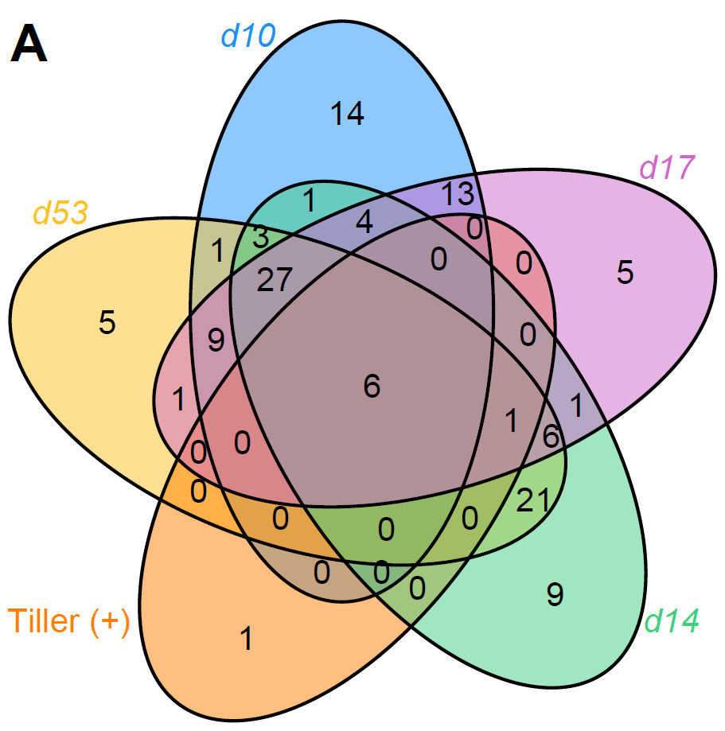
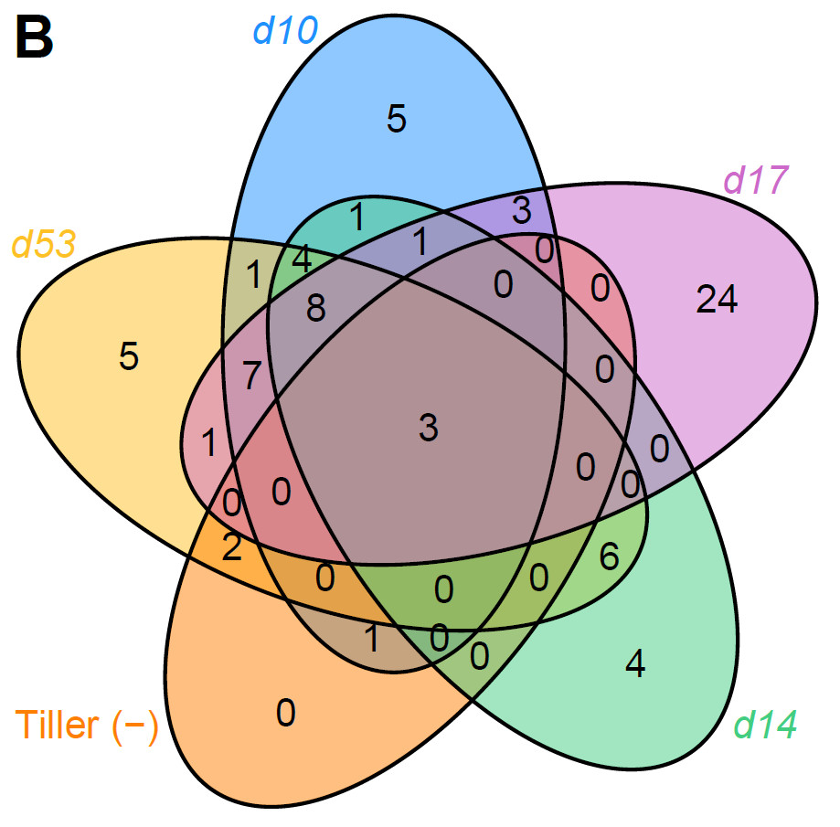
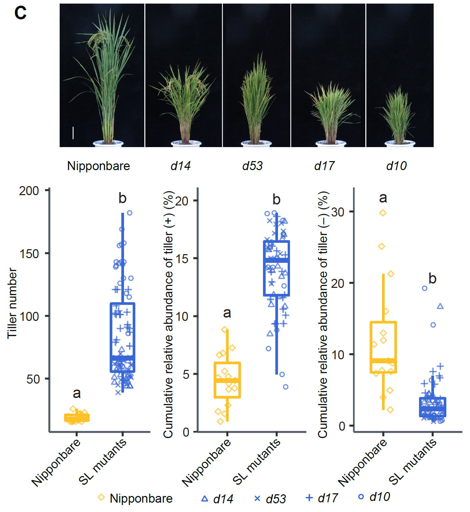

```{r setup, include=FALSE}
knitr::opts_chunk$set(
	echo=T, comment=NA, message=F, warning=F,
	fig.align="center", fig.width=5, fig.height=3, dpi=300)
# Clean workspace
rm(list=ls()) 
source("http://210.75.224.110/stat_plot_functions.R")
w=89
h=59
size=8
```

# Figure 6. The abundances of tiller-related genera are regulated by the SL pathway 

## 6A. The overlap of bacterial genera positively correlated with tiller number (tiller (+)) and bacterial genera that were enriched in SL pathway mutants (d10, d17, d14, and d53) compared to wild-type Nipponbare.



(A) The overlap of bacterial genera positively correlated with tiller number (tiller (+)) and bacterial genera that were enriched in SL pathway mutants (d10, d17, d14, and d53) compared to wild-type Nipponbare.

## 6B. The overlap of bacterial genera negatively correlated with tiller number (tiller (+)) and bacterial genera that were depleted in SL pathway mutants (d10, d17, d14, and d53) compared to wild-type Nipponbare.



(B) The overlap of bacterial genera negatively correlated with tiller number (tiller (+)) and bacterial genera that were depleted in SL pathway mutants (d10, d17, d14, and d53) compared to wild-type Nipponbare. Note that six out of the eight genera that positively correlated with tiller number were enriched in the root microbiota of all four SL mutants, whereas three genera that negatively correlated with tiller number were depleted in all SL mutants.

## 6C. Representative plants, abundance of tiller (+/-) genus and tiller number of field-grown Nipponbare wild-type and SL pathway mutants

### Tiller number

```{r}
alpha = read.table("../data/tillerNumberBeijing.txt", header=T, row.names=1, sep="\t", comment.char="")
design = read.table("../data/tillerNumberBeijing.txt", header=T, row.names=1, sep="\t")
# set group
design$group = design$Group
unique(design$group)

# Select by manual set group
if (TRUE){
	sub_design = subset(design, Genotype %in% c("Nip","d14","d53","d17","d10"))
# Set group order
	sub_design$group  = factor(sub_design$group, levels=c("Nipponbare", "Mutants"))
	sub_design$Genotype  = factor(sub_design$Genotype, levels=c("Nip","d14","d53","d17","d10"))
}else{
	sub_design = design
}
# save table
write.table("ID\t", file=paste("6C.tiller.txt",sep = ""), append = F, sep="\t", quote=F,  eol = "",row.names=F, col.names=F)
suppressWarnings(write.table(sub_design, file=paste("6C.tiller.txt",sep = ""), append = T, sep="\t", quote=F, row.names=T, col.names=T))

# filter
idx = rownames(sub_design) %in% rownames(alpha)
sub_design=sub_design[idx, , drop=F]
sub_alpha=alpha[rownames(sub_design),]

# add design to alpha
sub_alpha$Genotype  = factor(sub_alpha$Genotype, levels=c("Nip","d14","d53","d17","d10"))
index = cbind(sub_alpha, sub_design$group) 
colnames(index)[dim(index)[2]]="group"
table(sub_design$group)

method = c("TillerNumber")
m = method
model = aov(index[[m]] ~ group, data=index)
Tukey_HSD = TukeyHSD(model, ordered = TRUE, conf.level = 0.95)
Tukey_HSD_table = as.data.frame(Tukey_HSD$group) 
write.table(paste(m, "\n\t", sep=""), file=paste("6C.",m,".txt",sep=""),append = F, quote = F, eol = "", row.names = F, col.names = F)
suppressWarnings(write.table(Tukey_HSD_table, file=paste("6C.",m,".txt",sep=""), append = T, quote = F, sep="\t", eol = "\n", na = "NA", dec = ".", row.names = T, col.names = T))

# LSD test
out = LSD.test(model,"group", p.adj="none") # alternative fdr
stat = out$groups
index$stat=stat[as.character(index$group),]$groups
max=max(index[,c(m)])
min=min(index[,c(m)])
x = index[,c("group",m)]
y = x %>% group_by(group) %>% summarise_(Max=paste('max(',m,')',sep=""))
# suppressWarnings(write.table(index[,c(m,"group")], file=paste("6C.",m,"_raw.txt",sep=""), append = T, quote = F, sep="\t", eol = "\n", na = "NA", dec = ".", row.names = T, col.names = T))
y=as.data.frame(y)
rownames(y)=y$group
index$y=y[as.character(index$group),]$Max + (max-min)*0.05

group_mean = x %>% group_by(group) %>% summarise_all(mean)
# suppressWarnings(write.table(t(group_mean), file=paste("6C.",m,"_mean.txt",sep=""), append = T, quote = F, sep="\t", eol = "\n", na = "NA", dec = ".", row.names = T, col.names = F))

p = ggplot(index, aes(x=group, y=index[[m]], color=group)) +
	geom_boxplot(alpha=1, outlier.shape = NA, outlier.size=0, size=0.5, width=0.7, fill="transparent") +
	labs(x="Groups", y=paste(m, "")) + theme_classic() + main_theme +
	geom_text(data=index, aes(x=group, y=y, color=group, label= stat)) +
	geom_jitter(aes(shape=Genotype), position=position_jitter(0.3), size=0.5, alpha=0.5)
ggsave(paste("6C.boxplot", m, "4x3.pdf", sep=""), width = 89, height = 59, units = "mm")
p = p + theme(legend.position = "NA")
p=p+theme(axis.text.x=element_text(angle=45,vjust=1, hjust=1))
ggsave(paste("6C.boxplot", m, ".pdf", sep=""), width = 89*0.4*1.15, height = 59*1.3, units = "mm")
```


### Positive correlation

```{r}
genus = read.table("../data/SLmutant_genus.txt", header=T, row.names=1, sep="\t", comment.char="",quote="")
metadata = read.table("../data/SLmutant_metadata.txt", header=T, row.names=1, sep="\t", comment.char="",quote="")
group = "genotype3"
genus = as.data.frame(t(genus))[,c("Positive","Negative")]
genus = genus[rownames(metadata),]

# set order
unique(metadata$genotype)
metadata$genotype = factor(metadata$genotype, levels = c("Np","d14","d53","d17","d10"))
metadata$group  = factor(metadata$genotype3, levels=c("Nipponbare", "Mutants"))

# plotting
library(amplicon)
(p = alpha_boxplot(genus, index = "Positive", metadata, groupID = group ))
p = p + theme(legend.position = "NA")

m="Positive"
index = cbind(metadata,genus)
model = aov(index[[m]] ~ group, data=index)
Tukey_HSD = TukeyHSD(model, ordered = TRUE, conf.level = 0.95)
Tukey_HSD_table = as.data.frame(Tukey_HSD$group) 

out = LSD.test(model,"group", p.adj="none") # alternative fdr
stat = out$groups
index$stat=stat[as.character(index$group),]$groups
max=max(index[,c(m)])
min=min(index[,c(m)])
x = index[,c("group",m)]
y = x %>% group_by(group) %>% summarise_(Max=paste('max(',m,')',sep=""))
y=as.data.frame(y)
rownames(y)=y$group
index$y=y[as.character(index$group),]$Max + (max-min)*0.05
group_mean = x %>% group_by(group) %>% summarise_all(mean)

p = ggplot(index, aes(x=group, y=index[[m]], color=group)) +
	geom_boxplot(alpha=1, outlier.shape = NA, outlier.size=0, size=0.5, width=0.7, fill="transparent") +
	labs(x="Groups", y=paste(m, "")) + theme_classic() + main_theme +
	geom_text(data=index, aes(x=group, y=y, color=group, label= stat)) +
	geom_jitter(aes(shape=genotype), position=position_jitter(0.3), size=0.5, alpha=0.5)
ggsave(paste("6C.boxplot", m, "4x3.pdf", sep=""), width = 89, height = 59, units = "mm")
p = p + theme(legend.position = "NA")
p=p+theme(axis.text.x=element_text(angle=45,vjust=1, hjust=1))
ggsave(paste("6C.boxplot", m, ".pdf", sep=""), width = 89*0.4*1.3, height = 59*1.3, units = "mm")
```


### Negative correlation

```{r}
genus = read.table("../data/SLmutant_genus.txt", header=T, row.names=1, sep="\t", comment.char="",quote="")
metadata = read.table("../data/SLmutant_metadata.txt", header=T, row.names=1, sep="\t", comment.char="",quote="")
group = "genotype3"
genus = as.data.frame(t(genus))[,c("Negative","Negative")]
genus = genus[rownames(metadata),]

# set order
unique(metadata$genotype)
metadata$genotype = factor(metadata$genotype, levels = c("Np","d14","d53","d17","d10"))
metadata$group  = factor(metadata$genotype3, levels=c("Nipponbare", "Mutants"))

# plotting
library(amplicon)
(p = alpha_boxplot(genus, index = "Negative", metadata, groupID = group ))
p = p + theme(legend.position = "NA")

m="Negative"
index = cbind(metadata,genus)
model = aov(index[[m]] ~ group, data=index)
Tukey_HSD = TukeyHSD(model, ordered = TRUE, conf.level = 0.95)
Tukey_HSD_table = as.data.frame(Tukey_HSD$group) 

out = LSD.test(model,"group", p.adj="none") # alternative fdr
stat = out$groups
index$stat=stat[as.character(index$group),]$groups
max=max(index[,c(m)])
min=min(index[,c(m)])
x = index[,c("group",m)]
y = x %>% group_by(group) %>% summarise_(Max=paste('max(',m,')',sep=""))
y=as.data.frame(y)
rownames(y)=y$group
index$y=y[as.character(index$group),]$Max + (max-min)*0.05
group_mean = x %>% group_by(group) %>% summarise_all(mean)

p = ggplot(index, aes(x=group, y=index[[m]], color=group)) +
	geom_boxplot(alpha=1, outlier.shape = NA, outlier.size=0, size=0.5, width=0.7, fill="transparent") +
	labs(x="Groups", y=paste(m, "")) + theme_classic() + main_theme +
	geom_text(data=index, aes(x=group, y=y, color=group, label= stat)) +
	geom_jitter(aes(shape=genotype), position=position_jitter(0.3), size=0.5, alpha=0.5)
ggsave(paste("6C.boxplot", m, "4x3.pdf", sep=""), width = 89, height = 59, units = "mm")
p = p + theme(legend.position = "NA")
p=p+theme(axis.text.x=element_text(angle=45,vjust=1, hjust=1))
ggsave(paste("6C.boxplot", m, ".pdf", sep=""), width = 89*0.4*1.3, height = 59*1.3, units = "mm")
```



(C) Upper panel: representative plants of field-grown Nipponbare wild-type and SL pathway mutants. Scale bars = 10 cm. Lower panel: tiller number (left), cumulative abundance of tiller (+) (middle) and tiller () (right) genera in SL mutants and wild-type Nipponbare. Note that root microbiota of the SL mutants with higher tiller number enriched bacteria positively correlated with tiller number, and depleted bacteria negatively correlated with tiller number. The horizontal bars within boxes represent medians. The tops and bottoms of the boxes represent the 75th and 25th percentiles, respectively. The upper and lower whiskers extend to data within no more than 1.5× the interquartile range from the upper edge and lower edge of the box, respectively. Different letters indicate significantly different groups in each data set (P < 0.001, Wilcoxon rank sum test). The numbers of replicates for root microbiota samples in this figure are as follows: Nipponbare (n = 15), d10 (n = 15), d14 (n = 15), d17 (n = 15), and d53 (n = 15).

