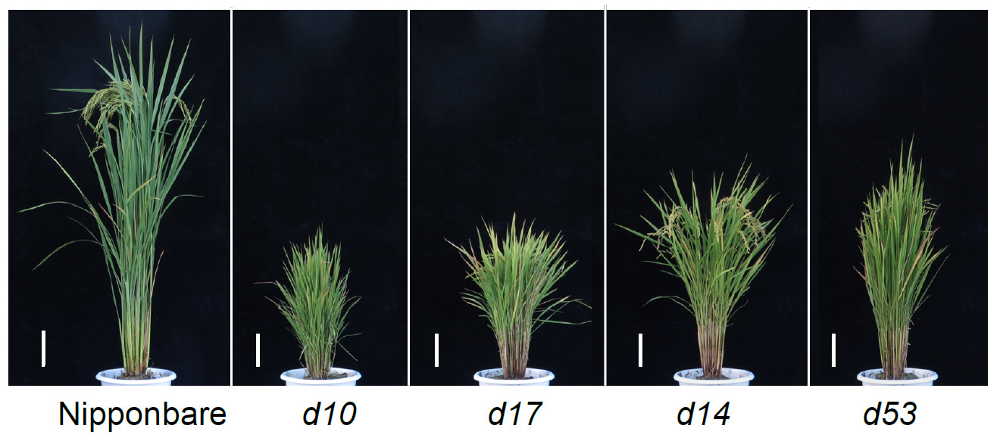
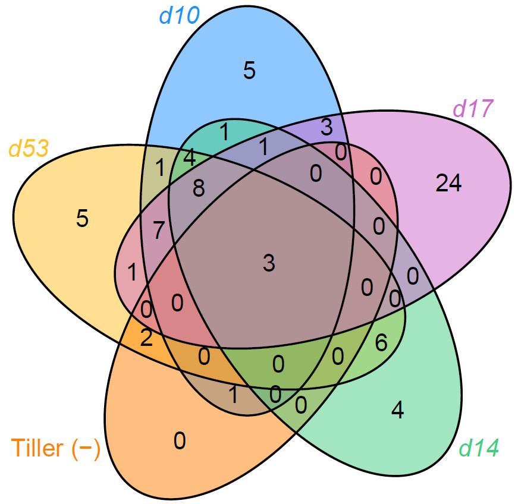
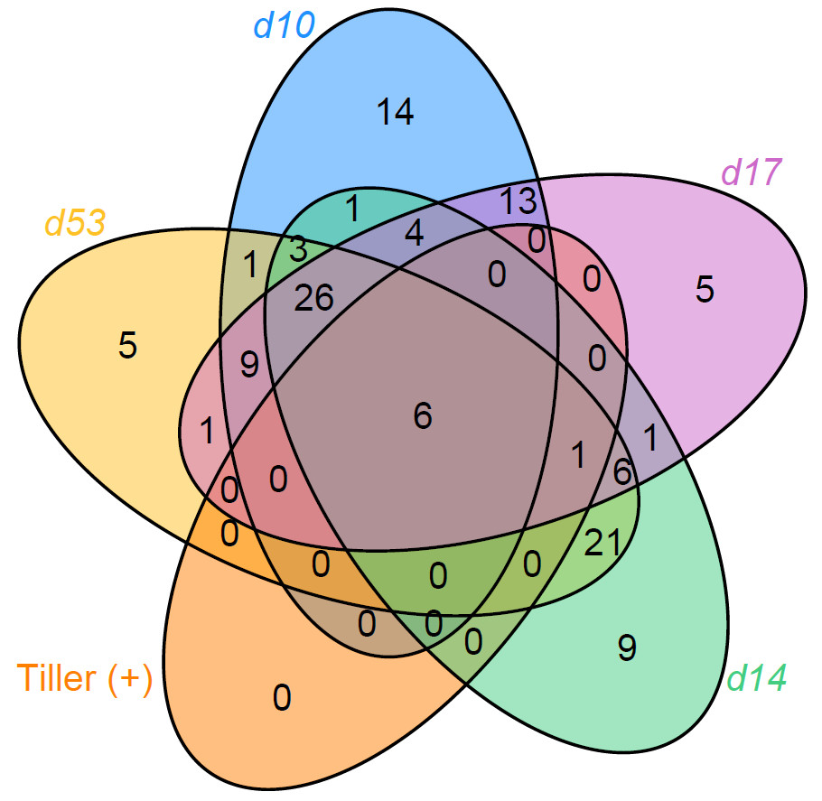

```{r setup, include=FALSE}
knitr::opts_chunk$set(
	echo=T, comment=NA, message=F, warning=F,
	fig.align="center", fig.width=5, fig.height=3, dpi=300)
# Clean workspace
rm(list=ls()) 
source("http://210.75.224.110/stat_plot_functions.R")
w=89
h=59
size=8
```


## 6A. Representative plants in field-grown Nipponbare wild-type and SL pathway mutants

This drawing is take photo from rice.



## 6B. Representative tiller number in field-grown Nipponbare wild-type and SL pathway mutants


相关属在D系列中的丰度

```{r}
alpha = read.table("SLtiller.txt", header=T, row.names=1, sep="\t", comment.char="") 
design = read.table("SLtiller.txt", header=T, row.names=1, sep="\t")
design$group=design$Genotype

# Select by manual set group
if (TRUE){
	sub_design = subset(design, group %in% c("Nip","d10","d17","d14","d53"))
# Set group order
	sub_design$group  = factor(sub_design$group, levels=c("Nip","d10","d17","d14","d53"))
}else{
	sub_design = design
}

idx = rownames(sub_design) %in% rownames(alpha)
sub_design=sub_design[idx, , drop=F]
sub_alpha=alpha[rownames(sub_design),]

# add design to alpha
index = cbind(sub_alpha, sub_design$group) 
colnames(index)[dim(index)[2]]="group"
table(sub_design$group)

m="TillerNumber"
model = aov(index[[m]] ~ group, data=index)
Tukey_HSD = TukeyHSD(model, ordered = TRUE, conf.level = 0.95)
Tukey_HSD_table = as.data.frame(Tukey_HSD$group) 
write.table(paste(m, "\n\t", sep=""), file=paste("5b.",m,".txt",sep=""),append = F, quote = F, eol = "", row.names = F, col.names = F)
suppressWarnings(write.table(Tukey_HSD_table, file=paste("5b.",m,".txt",sep=""), append = T, quote = F, sep="\t", eol = "\n", na = "NA", dec = ".", row.names = T, col.names = T))
out = LSD.test(model,"group", p.adj="none") # alternative fdr
stat = out$groups
index$stat=stat[as.character(index$group),]$groups
max=max(index[,c(m)])
min=min(index[,c(m)])
x = index[,c("group",m)]
y = x %>% group_by(group) %>% summarise_(Max=paste('max(',m,')',sep=""))
suppressWarnings(write.table(index[,c(m,"group")], file=paste("5b.",m,"_raw.txt",sep=""), append = T, quote = F, sep="\t", eol = "\n", na = "NA", dec = ".", row.names = T, col.names = T))
y=as.data.frame(y)
rownames(y)=y$group
index$y=y[as.character(index$group),]$Max + (max-min)*0.05

group_mean = x %>% group_by(group) %>% summarise_all(mean)
suppressWarnings(write.table(t(group_mean), file=paste("5b.",m,"_mean.txt",sep=""), append = T, quote = F, sep="\t", eol = "\n", na = "NA", dec = ".", row.names = T, col.names = F))


p = ggplot(index, aes(x=group, y=index[[m]], color=group)) +
	geom_boxplot(alpha=1, outlier.shape = NA, outlier.size=0, size=0.7, width=0.5, fill="transparent") +
	labs(x="Groups", y=paste(m, "")) + theme_classic() + main_theme +
	geom_text(data=index, aes(x=group, y=y, color=group, label= stat)) +
	geom_jitter( position=position_jitter(0.17), size=1, alpha=0.7)
# if (length(unique(sub_design$group))>3){
# 	p=p+theme(axis.text.x=element_text(angle=45,vjust=1, hjust=1))
# }
p = p + ylim(0,200)
p
ggsave(paste("5b.", m, ".pdf", sep=""), p, width = 4.3, height = 2.5)
```

## 6C. The overlap of bacterial genera positively correlated with tiller number (tiller (+))




## 6D. The overlap of bacterial genera negatively correlated with tiller number (tiller ()) 



